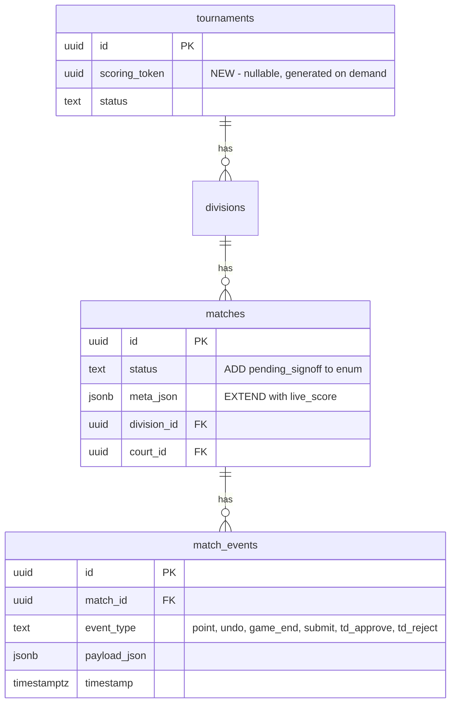

# feat: Slim Scoring, Court TV & TD Sign-Off

## Overview

Build the live scoring loop: referee scores point-by-point on their phone, Court TV shows all courts with live scores in real-time, and the TD signs off on results before they count. This is the first introduction of Supabase Realtime, token-based public access, and the match events audit log into the codebase.

**Brainstorm**: `docs/brainstorms/2026-02-21-phase4-slim-scoring-court-tv-brainstorm.md`

## Problem Statement

Today, all scoring is post-match bulk entry by the TD through the Control Center. There is no live scoring, no public scoreboard, no audit trail, and no referee involvement. Spectators cannot see scores. The TD must manually enter every result. This bottleneck slows tournament flow and provides no real-time visibility.

## Proposed Solution

Three new surfaces connected by Supabase Realtime:

1. **Referee Scoring App** (`/score/[token]?court={courtId}`) — point-by-point scoring on phone
2. **Court TV** (`/tv/[tournamentId]`) — multi-court overview with live scores for wall display
3. **TD Sign-Off** — referee submits → TD approves/rejects in Control Center

## Technical Approach

### Architecture

```
Referee Phone                           Court TV (Wall Display)
     |                                        |
     | 1. supabase.rpc('score_point',         | 3. Supabase Broadcast
     |    {token, matchId, side})              |    subscription (20-80ms)
     v                                        v
Supabase RPC (SECURITY DEFINER)         Broadcast Channel
     |                                   (match:{matchId})
     | validates token + match                 ^
     | SELECT ... FOR UPDATE (lock)            |
     | INSERT match_event                      |
     | UPDATE meta_json.live_score             |
     | RETURNS new state                       |
     v                                        |
     2. Client sends Broadcast ───────────────┘
        with new match state
                                    Control Center (TD)
                                      Broadcast subscription
                                      + Approve/Reject server actions
```

**Key architectural decisions:**

1. **Referee calls RPC functions directly** via the Supabase anon key client. Each RPC is `SECURITY DEFINER` (bypasses RLS) and validates the tournament scoring token as its first parameter. No intermediate API route needed — eliminates a network hop and the need for a service-role client.

2. **Dual-channel realtime: Broadcast (fast) + DB persist (durable)** — After the RPC returns, the referee client sends a Supabase Broadcast message with the new match state. Court TV and Control Center subscribe to this Broadcast channel for instant updates (20-80ms). The DB write provides durability and the audit trail. This avoids the `postgres_changes` single-threaded RLS bottleneck that would cause latency issues with 35-65 subscribers.

3. **Atomic scoring via RPC with row locking** — Each RPC function begins with `SELECT ... FOR UPDATE` on the match row, preventing two rapid taps from producing inconsistent state. The function then inserts the match event AND updates `matches.meta_json.live_score` in one transaction.

4. **TD retains direct completion** — TD can still go `on_court → completed` directly from Control Center (existing flow preserved). Referee-submitted matches go through `pending_signoff`.

### Data Model Changes



### Updated Match State Machine

```
scheduled ──► ready ──► on_court ──► pending_signoff ──► completed
                │           │              │                ▲
                │           │              │                │
                │           │              └─► walkover     │
                │           │                               │
                │           └──────── completed ────────────┘  (TD direct path)
                │           │
                │           └──────── walkover
                └──────── walkover
```

Transitions:
- `on_court → pending_signoff` — referee submits match
- `on_court → completed` — TD records result directly (existing flow)
- `on_court → walkover` — TD or referee records walkover
- `pending_signoff → completed` — TD approves
- `pending_signoff → on_court` — TD rejects (referee continues)
- `pending_signoff → walkover` — TD converts to walkover

### `meta_json` Extended Structure

```typescript
// types/database.ts — updated MatchScoreData
interface MatchScoreData {
  games: GameScore[]           // completed games
  total_points_a: number
  total_points_b: number
  walkover?: boolean
  bye?: boolean
  live_score?: {               // NEW — current game in progress
    current_game: number       // 1-indexed game number
    score_a: number
    score_b: number
  }
}
```

**Important:** `live_score` must be cleared (set to undefined/omitted) when a match transitions to `completed` or `walkover`, to prevent stale indicators on Court TV.

### Implementation Phases

#### Phase 4a: Database & Infrastructure (Foundation)

**Migration: `20250104000001_phase4_scoring_tv.sql`**

- [x]Add `scoring_token UUID` column to `bracket_blaze_tournaments`
- [x]Add `pending_signoff` value to `bracket_blaze_match_status` enum
- [x]Enable Supabase Realtime on `bracket_blaze_matches` table: `ALTER PUBLICATION supabase_realtime ADD TABLE bracket_blaze_matches`
- [x]Add RLS policy: anon SELECT on `bracket_blaze_matches` for published divisions
- [x]Add RLS policy: anon SELECT on `bracket_blaze_match_events` for published divisions
- [x]Grant EXECUTE on all scoring RPCs to `anon` role
- [x]Create `score_point(p_token UUID, p_match_id UUID, p_side TEXT)` RPC function (SECURITY DEFINER):
  - Validates token against tournament
  - `SELECT ... FOR UPDATE` on match row (prevents concurrent corruption)
  - Validates match status is `on_court`
  - Validates `p_side` is `'A'` or `'B'`
  - Inserts `point` event into `match_events`
  - Updates `matches.meta_json.live_score` (increment score)
  - Returns new match state as JSONB
- [x]Create `undo_point(p_token UUID, p_match_id UUID)` RPC function (SECURITY DEFINER):
  - Same token validation and row locking
  - Reads last `point` event for this match in current game
  - Guards against undo when no points exist (returns error)
  - Inserts `undo` event referencing the reverted event
  - Decrements `matches.meta_json.live_score`
  - Returns new match state
- [x]Create `end_game(p_token UUID, p_match_id UUID)` RPC function:
  - Same validation and locking
  - Guards against ending a game at 0-0
  - Inserts `game_end` event
  - Pushes current live_score to `meta_json.games[]`
  - Resets `live_score` for next game (current_game + 1, scores to 0)
  - Returns new match state
- [x]Create `submit_match(p_token UUID, p_match_id UUID)` RPC function:
  - Same validation, validates status is `on_court`
  - Inserts `submit` event with final games summary
  - Transitions status to `pending_signoff`
  - Returns new match state

**TypeScript updates:**

- [x]Update `MatchStatus` type in `types/database.ts` to include `pending_signoff`
- [x]Update `MatchScoreData` interface with optional `live_score` field
- [x]Add `scoring_token` to `Tournament` type
- [x]Update `VALID_TRANSITIONS` in `lib/actions/matches.ts`:
  ```typescript
  on_court: ['pending_signoff', 'completed', 'walkover'],
  pending_signoff: ['completed', 'on_court', 'walkover'],
  ```
- [x]Update `clearCourt()` in `lib/actions/court-assignments.ts` to block clearing `pending_signoff` matches

**Middleware update:**

- [x]Update matcher in `middleware.ts` to exclude `/score/` and `/tv/` routes from auth redirect:
  ```typescript
  '/((?!_next/static|_next/image|favicon.ico|tv/|score/|.*\\.(?:svg|png|jpg|jpeg|gif|webp)$).*)'
  ```

**Success criteria**: Migration applies cleanly. TypeScript compiles. Existing flows unaffected.

#### Phase 4b: Token Management & Match Actions

**Server Actions: `lib/actions/scoring-token.ts`**

- [x]`generateScoringToken(tournamentId)` — generates UUID, upserts into `bracket_blaze_tournaments.scoring_token` (regeneration overwrites old token), returns token

**Server Actions: `lib/actions/matches.ts` updates**

- [x]Extract `finalizeMatch(supabase, matchId, winnerSide, games)` internal helper from existing `completeMatch()` — handles: setting final `meta_json` (clearing `live_score`), setting `winner_side`, `actual_end_time`, knockout advancement, standings recalculation
- [x]`approveMatch(matchId)` — auth check, transitions `pending_signoff → completed`, calls `finalizeMatch()`, writes `td_approve` event
- [x]`rejectMatch(matchId, note?)` — auth check, transitions `pending_signoff → on_court`, writes `td_reject` event with note in payload
- [x]Refactor existing `completeMatch()` to call shared `finalizeMatch()` internally
- [x]Add `start_match_from_referee(p_token UUID, p_match_id UUID)` as RPC function — validates token, transitions `ready → on_court`, initializes `live_score: { current_game: 1, score_a: 0, score_b: 0 }` in meta_json

**Success criteria**: Token generation works. Approve/reject flow works. Shared finalization logic prevents divergence.

#### Phase 4c: Referee Scoring UI

**Route: `app/score/[token]/page.tsx`**

- [x]Server component: validate token against `bracket_blaze_tournaments`, get tournament + courts
- [x]If `?court={courtId}`: look up match on that court with status `on_court` or `ready`
- [x]If no court param: show court selection grid (link each active court with its current match status)
- [x]If no match on court: show "No active match on this court. Waiting for TD to assign."
- [x]If match in `ready` status: show match info + "Start Match" button
- [x]If match in `on_court` status: show scoring interface

**Client component: `components/scoring/scoring-client.tsx`**

- [x]Display: division name, round info (e.g. "R2 M5"), player names prominently
- [x]Score display: completed games row (e.g. "21-18, 15-11") + current game score large
- [x]Large touch buttons: "+1 A" / "+1 B" (full width, tall, side-by-side)
- [x]"Undo" button (smaller, below score buttons)
- [x]"End Game" button (triggers confirmation: "End Game 2? Score: 21-15")
- [x]"Submit Match" button (triggers confirmation dialog showing final score summary)
- [x]All actions call RPCs directly: `supabase.rpc('score_point', { p_token, p_match_id, p_side })`
- [x]After each RPC returns: send Broadcast message with new match state to `match:{matchId}` channel
- [x]Subscribe to Broadcast on own match channel for: multi-device sync, TD reject notification
- [x]Subscribe to `postgres_changes` on own match (single row, `filter: id=eq.{matchId}`) for status transitions (reject → on_court, approve → completed)
- [x]When status changes to `pending_signoff`: show "Submitted — waiting for TD sign-off" with score summary
- [x]When status changes back to `on_court` (rejected): show TD note (from latest `td_reject` event), re-enable scoring
- [x]When status changes to `completed` (approved): show "Match Complete" confirmation

**Success criteria**: Referee can score a full match from phone. Points persist. Undo works. Game transitions work. Submit sends to pending_signoff.

#### Phase 4d: Court TV Display

**Route: `app/tv/[tournamentId]/page.tsx`**

- [x]Server component: fetch all courts + assigned matches (with entries/participants joined) + list of division IDs for this tournament
- [x]Public route — no auth required

**Client component: `components/court-tv/court-tv-client.tsx`**

- [x]Grid layout: 2-col for ≤4 courts, 3-col for 5-7 courts (responsive)
- [x]Each court card shows:
  - Court name (large, top)
  - Player names for both sides
  - Live score: completed games + current game score
  - Status badge: Empty (gray), Ready (blue), In Play (green pulse), Pending Sign-Off (yellow), Completed (checkmark)
  - Division name (small, bottom)
- [x]Subscribe to Supabase Broadcast channels for each active match (one channel per court's current match): `match:{matchId}` — receives instant score ticks from referee
- [x]Also subscribe to `postgres_changes` on `bracket_blaze_matches` filtered by division IDs for status transitions (match assignments, completions, new rounds)
- [x]High contrast: dark background, white text, large fonts (min 24px scores, 18px names)
- [x]Reconnect on visibility change (tab/screen wake) via `document.visibilitychange` listener

**Success criteria**: Court TV shows all courts with live updates. Score updates appear within 100ms via Broadcast. Works on wall-mounted display.

#### Phase 4e: Control Center Integration

**Sign-Off on court cards (in existing `court-grid.tsx`):**

- [x]Add `pending_signoff` case to court card status badge (amber/yellow variant)
- [x]When match status is `pending_signoff`: show Approve and Reject buttons on the court card (same pattern as existing "Start" and "Record Result" buttons)
- [x]"Approve" calls `approveMatch()` server action
- [x]"Reject" shows inline text input for optional note, then calls `rejectMatch()` server action

**Live score on court cards:**

- [x]Court cards show live score from `meta_json.live_score` when match is `on_court`
- [x]Subscribe to Broadcast channels for live score updates (same pattern as Court TV)

**Token Management (in Control Center header):**

- [x]"Generate Scoring Link" button in Control Center header → calls `generateScoringToken()` → shows copyable URL in a small popover/dialog
- [x]URL format: `{baseUrl}/score/{token}` (referee selects their court from the scoring page itself)
- [x]If token already exists, show it with a "Regenerate" button (overwrites old token with confirmation)

**Success criteria**: TD can generate scoring link, approve/reject referee-submitted matches. Live scores visible on court cards.

## Acceptance Criteria

### Functional Requirements

- [x]TD can generate a tournament scoring token and copy the URL
- [x]Referee can open scoring URL and select their court from a grid
- [x]Referee can start a match that is in `ready` status
- [x]Referee can score points (+1 A, +1 B) and see the score update
- [x]Referee can undo the last point
- [x]Referee can end a game and start the next one
- [x]Referee can submit a match for TD sign-off (with confirmation dialog)
- [x]TD can approve a submitted match (standings update, bracket advances)
- [x]TD can reject a submitted match with an optional note
- [x]Referee sees rejection notification with TD's note and can continue scoring
- [x]Court TV shows all courts with live scores updating in real-time
- [x]Court TV works without authentication
- [x]TD can still record results directly from Control Center (existing flow preserved)
- [x]Match events are written to `bracket_blaze_match_events` as an immutable audit log
- [x]Token can be regenerated by TD (invalidates old token)

### Non-Functional Requirements

- [x]Score updates appear on Court TV within 100ms of referee tap (via Broadcast)
- [x]System handles 7 simultaneous courts with live scoring
- [x]Referee scoring UI has large touch targets (min 48px tap areas)
- [x]Court TV is readable from 3+ meters (large fonts, high contrast)
- [x]Court TV reconnects automatically after network interruption

## Dependencies & Prerequisites

- Supabase Realtime must be enabled on the project (Dashboard → Database → Replication)
- Existing Phase 3 match flow (court assignment, match start, complete, standings) must be working

## Risk Analysis & Mitigation

| Risk | Likelihood | Impact | Mitigation |
|------|-----------|--------|------------|
| Broadcast message lost (stale Court TV) | Low | Low | Court TV also subscribes to postgres_changes for status transitions. Periodic full sync every 30s as fallback. |
| Token leaked to spectator | Medium | Medium | Accept for MVP. "Regenerate" invalidates old token. |
| Two rapid taps produce wrong score | Low | High | `SELECT ... FOR UPDATE` in RPC serializes concurrent writes to same match. |
| WebSocket disconnect on kiosk TV | Medium | Medium | Auto-reconnect with `visibilitychange` listener. Supabase client has built-in retry. |
| Concurrent TD approve + referee score | Low | Medium | Approve transitions status; further RPC calls fail validation (`status != 'on_court'`). |

## Out of Scope

- Sport-specific scoring rules (win-by-2, cap at 30, auto game end)
- PWA / offline tolerance / service worker
- Individual referee accounts
- Single-court TV kiosk mode
- "Up Next" preview on Court TV
- Server/ends tracking
- Match SLA tracking
- QR code generation (referee selects court from scoring page)
- Rate limiting on scoring RPCs (acceptable at MVP scale)

## Future Considerations

After this phase validates the real-time pipe:
- **Phase 4.5**: Sport-specific scoring engines (badminton, squash, pickleball, padel)
- **Phase 4.6**: PWA with offline queue for referee app
- **Phase 4.7**: Single-court TV with detailed scoreboard + up next + QR codes
- **Phase 4.8**: Read-only REST API for agent/programmatic access
- **Phase 5**: Player Portal with My Matches and live draws

## References & Research

### Internal References

- Brainstorm: `docs/brainstorms/2026-02-21-phase4-slim-scoring-court-tv-brainstorm.md`
- Match actions: `lib/actions/matches.ts` (VALID_TRANSITIONS, completeMatch, startMatch)
- Match types: `types/database.ts:11` (MatchStatus enum), `types/database.ts:202` (MatchScoreData)
- Control Center: `components/control-center/control-center-client.tsx`
- Court grid: `components/control-center/court-grid.tsx`
- Court assignments: `lib/actions/court-assignments.ts` (clearCourt guard needs updating)
- Middleware: `middleware.ts` + `lib/supabase/middleware.ts`
- Supabase client: `lib/supabase/client.ts` (browser), `lib/supabase/server.ts` (server)
- Match events table: `supabase/migrations/20250101000000_initial_schema.sql:117`
- RLS policies: `supabase/migrations/20250101000003_rls_policies_prefixed.sql`

### External References

- Supabase Realtime Broadcast: https://supabase.com/docs/guides/realtime/broadcast
- Supabase Realtime Postgres Changes: https://supabase.com/docs/guides/realtime/postgres-changes
- Supabase Realtime Authorization (RLS): https://supabase.com/docs/guides/realtime/authorization
- Supabase RPC / SECURITY DEFINER: https://supabase.com/docs/guides/database/postgres/row-level-security
- Next.js 15 Middleware matcher: https://nextjs.org/docs/15/app/api-reference/file-conventions/middleware

### Key Files to Create/Modify

| File | Purpose |
|------|---------|
| `supabase/migrations/20250104000001_phase4_scoring_tv.sql` | Schema changes + RPC functions |
| `app/score/[token]/page.tsx` | Referee scoring page (server component) |
| `components/scoring/scoring-client.tsx` | Referee scoring UI (client component) |
| `app/tv/[tournamentId]/page.tsx` | Court TV page (server component) |
| `components/court-tv/court-tv-client.tsx` | Court TV grid (client component) |
| `lib/actions/scoring-token.ts` | Token generation server action |
| **Modified:** `lib/actions/matches.ts` | Add approveMatch, rejectMatch, extract finalizeMatch |
| **Modified:** `lib/actions/court-assignments.ts` | Update clearCourt guard for pending_signoff |
| **Modified:** `components/control-center/court-grid.tsx` | Add pending_signoff status + Approve/Reject buttons |
| **Modified:** `components/control-center/control-center-client.tsx` | Add Broadcast subscription, token management UI |
| **Modified:** `types/database.ts` | Add pending_signoff status, live_score type, scoring_token |
| **Modified:** `middleware.ts` | Exclude /score/ and /tv/ from auth redirect |
