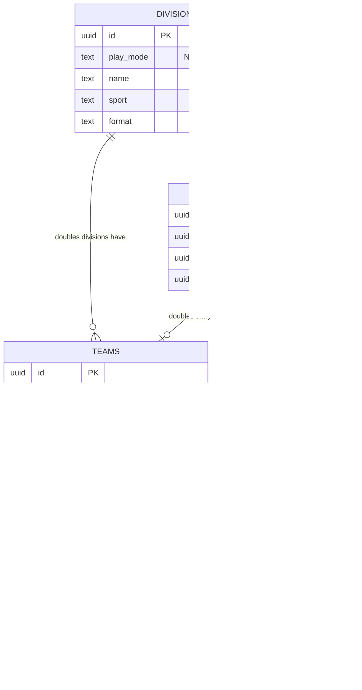

# feat: Doubles Division & Team Management

## Overview

Add doubles support across the platform: a `play_mode` field on divisions, a team creation flow where TDs pick two participants to form a pair, and a centralized display name resolver that shows "Player A / Player B" everywhere singles names currently appear.

The database schema already supports teams (`bracket_blaze_teams`, `bracket_blaze_team_members`, entries XOR constraint). The work is primarily: one migration, UI for team creation, and updating ~14 components/queries to resolve display names through a shared utility.

## Problem Statement / Motivation

Doubles is standard in racquet sports tournaments. A TD running a badminton event needs Men's Singles, Men's Doubles, and Mixed Doubles divisions. The schema was designed for this from day one, but the UI only handles singles. Without doubles support, TDs must run separate tournaments or track doubles manually.

## Proposed Solution

Three layers of change:

1. **Schema**: Add `play_mode` column to divisions (`singles` | `doubles`)
2. **Entry management**: Doubles-aware entry dialog that pairs two participants into a team
3. **Display names**: Centralized resolver + updated queries across 14 components

## Technical Approach

### Database Change



### Implementation Steps

#### Phase 1: Foundation (Migration + Display Name Resolver)

##### Step 1: Migration — Add `play_mode` to divisions
- [x] Create `supabase/migrations/YYYYMMDD_add_play_mode_to_divisions.sql`
- [x] Add column: `ALTER TABLE bracket_blaze_divisions ADD COLUMN play_mode TEXT NOT NULL DEFAULT 'singles' CHECK (play_mode IN ('singles', 'doubles'));`
- [x] Default `'singles'` ensures backward compatibility — all existing divisions stay singles
- [x] Push migration to Supabase

##### Step 2: TypeScript types update
- [x] Add `play_mode` to `Division` interface in `types/database.ts`
  - `play_mode: 'singles' | 'doubles'`
- [x] Add `PlayMode` type: `export type PlayMode = 'singles' | 'doubles'`

##### Step 3: Display name resolver utility
- [x] Create `lib/utils/display-name.ts`
- [x] Single function that handles both singles and doubles:

```typescript
// lib/utils/display-name.ts
export function getEntryDisplayName(entry: {
  participant?: { display_name: string } | null
  team?: { name: string } | null
}): string {
  if (entry.participant?.display_name) return entry.participant.display_name
  if (entry.team?.name) return entry.team.name
  return "TBD"
}
```

##### Step 4: Update all Supabase queries to join team data
- [x] Every query that joins `side_a`/`side_b` entries needs the team join added:

```
side_a:bracket_blaze_entries!side_a_entry_id(
  id, seed,
  participant:bracket_blaze_participants(display_name, club),
  team:bracket_blaze_teams(name)
)
```

Locations to update (14 files):

| File | Query Location |
|------|---------------|
| `app/tournaments/[id]/control-center/page.tsx` | Match query (line ~57), entries query (line ~97) |
| `app/tv/[tournamentId]/page.tsx` | Match query (line ~46) |
| `app/live/[tournamentId]/page.tsx` | Match query (line ~37), entries query (line ~77) |
| `app/score/[token]/page.tsx` | Match query (line ~52) |
| `app/tournaments/[id]/divisions/[divisionId]/matches/page.tsx` | Match query |
| `app/tournaments/[id]/divisions/[divisionId]/entries/page.tsx` | Entries query |

##### Step 5: Update all display name references to use resolver
- [x] Replace all `?.participant?.display_name || "TBD"` with `getEntryDisplayName(entry)`

Components to update:

| Component | File |
|-----------|------|
| ControlCenterClient | `components/control-center/control-center-client.tsx` |
| ReadyQueue | `components/control-center/ready-queue.tsx` |
| CourtGrid | `components/control-center/court-grid.tsx` |
| StandingsSection | `components/control-center/standings-section.tsx` |
| ResultsSection | `components/control-center/results-section.tsx` |
| CourtTvClient | `components/court-tv/court-tv-client.tsx` |
| MatchCard (Live Portal) | `components/live-portal/match-card.tsx` |
| Scoring page | `app/score/[token]/page.tsx` |
| Matches page | `app/tournaments/[id]/divisions/[divisionId]/matches/page.tsx` |

#### Phase 2: Division Form & Validation

##### Step 6: Update division validation schema
- [x] Add `play_mode` to `divisionSchema` in `lib/validations/tournament.ts`:
  - `play_mode: z.enum(["singles", "doubles"]).default("singles")`

##### Step 7: Update division creation form
- [x] Add play mode selector to `components/divisions/division-dialog.tsx`
  - Simple Select: "Singles" / "Doubles" (default: Singles)
  - Place after Sport selector, before Format selector
- [x] Update `createDivision` server action in `lib/actions/divisions.ts` to accept and store `play_mode`

#### Phase 3: Doubles Entry Management

##### Step 8: Update entry dialog for doubles
- [x] In `components/entries/entry-dialog.tsx`, check division's `play_mode`
- [x] Singles mode: existing flow (pick one participant)
- [x] Doubles mode: pick two participants from the pool
  - Two Select dropdowns (Player 1, Player 2)
  - Validation: both must be selected, can't pick the same player twice
  - Auto-generate team name: "Player 1 / Player 2"

##### Step 9: Create team entry server action
- [x] Update `lib/actions/entries.ts` with a `createDoubleEntry` function (or extend `createEntry`):
  1. Create team record (`bracket_blaze_teams`) with auto-generated name
  2. Create two team_member records
  3. Create entry with `team_id` (not `participant_id`)
  4. All in a transaction-like flow (check for errors at each step)
- [x] Validate: prevent duplicate team (same two players in same division)

##### Step 10: Update entry list for doubles display
- [x] In `components/entries/entry-list.tsx`, update the local `EntryWithParticipant` interface to support team entries
- [x] Update entries query in `app/tournaments/[id]/divisions/[divisionId]/entries/page.tsx`:

```
.select(`
  *,
  participant:bracket_blaze_participants(*),
  team:bracket_blaze_teams(
    id, name,
    members:bracket_blaze_team_members(
      participant:bracket_blaze_participants(display_name, club)
    )
  )
`)
```

- [x] Display: show "Player A / Player B" for doubles entries (from `team.name`), single name for singles

#### Phase 4: Conflict Detection Update

##### Step 11: Update conflict detection for doubles
- [x] In `lib/actions/court-assignments.ts`, update `checkConflicts()`:
  - For singles entries: use `entry.participant_id` (existing)
  - For doubles entries: resolve `team_id → team_members → participant_ids` to get both players
  - Check all resolved participant IDs for court overlap and rest period conflicts
- [x] This ensures if Player A is in Singles and also in Doubles with Player B, the system detects when both their matches overlap

### File Changes Summary

| File | Action | Description |
|------|--------|-------------|
| `supabase/migrations/YYYYMMDD_*.sql` | Create | Add `play_mode` column |
| `types/database.ts` | Edit | Add `PlayMode` type, update `Division` |
| `lib/utils/display-name.ts` | Create | Centralized display name resolver |
| `lib/validations/tournament.ts` | Edit | Add `play_mode` to Zod schema |
| `lib/actions/divisions.ts` | Edit | Accept `play_mode` in create/update |
| `lib/actions/entries.ts` | Edit | Add doubles entry creation flow |
| `lib/actions/court-assignments.ts` | Edit | Resolve team members for conflict detection |
| `components/divisions/division-dialog.tsx` | Edit | Add play mode selector |
| `components/entries/entry-dialog.tsx` | Edit | Doubles mode: pick two participants |
| `components/entries/entry-list.tsx` | Edit | Show team names for doubles |
| 6 server pages | Edit | Add team joins to Supabase queries |
| 9 client components | Edit | Use `getEntryDisplayName()` resolver |

## Acceptance Criteria

### Functional
- [x] TD can create a division with play_mode "doubles"
- [x] TD can pair two participants into a doubles team when creating entries
- [x] Team name auto-generated as "Player A / Player B"
- [x] Doubles entries show team names in entry list, standings, match cards, Court TV, referee app, and live portal
- [x] Existing singles divisions unaffected (backward compatible)
- [x] Same player can be in a singles division AND a doubles division
- [x] Conflict detection works for doubles (detects when any team member is double-booked)
- [x] Cannot pair the same player with themselves
- [x] Cannot create duplicate team (same two players in same division)
- [x] Withdrawing a player from a doubles team withdraws the entire entry (team can't play with one person)

### Non-Functional
- [x] All existing components continue to work for singles (no regressions)
- [x] `play_mode` defaults to `'singles'` — zero impact on existing data

## Dependencies & Risks

**Dependencies**: None — schema foundation already exists.

**Risks**:
- **Wide surface area (14+ files)**: Mitigated by the centralized resolver pattern — most changes are mechanical (swap hardcoded name access for function call).
- **Entry dialog complexity**: Doubles mode needs two participant selectors with validation. This is the most new UI code.
- **Conflict detection**: Must resolve team members to individual participant IDs. If missed, doubles players won't get overlap/rest warnings.

## References & Research

### Internal References
- Brainstorm: `docs/brainstorms/2026-02-22-doubles-division-team-management-brainstorm.md`
- Teams schema: `supabase/migrations/20250101000002_add_prefix.sql:83-97`
- Entries XOR constraint: `supabase/migrations/20250101000002_add_prefix.sql:108-110`
- TypeScript types: `types/database.ts:82-94` (Team, TeamMember)
- Extended types: `types/database.ts:240-245` (EntryWithParticipant with team support)
- Division form: `components/divisions/division-dialog.tsx`
- Entry dialog: `components/entries/entry-dialog.tsx`
- Entry actions: `lib/actions/entries.ts`
- Conflict detection: `lib/actions/court-assignments.ts:30-43`
- Division validation: `lib/validations/tournament.ts:15-23`
