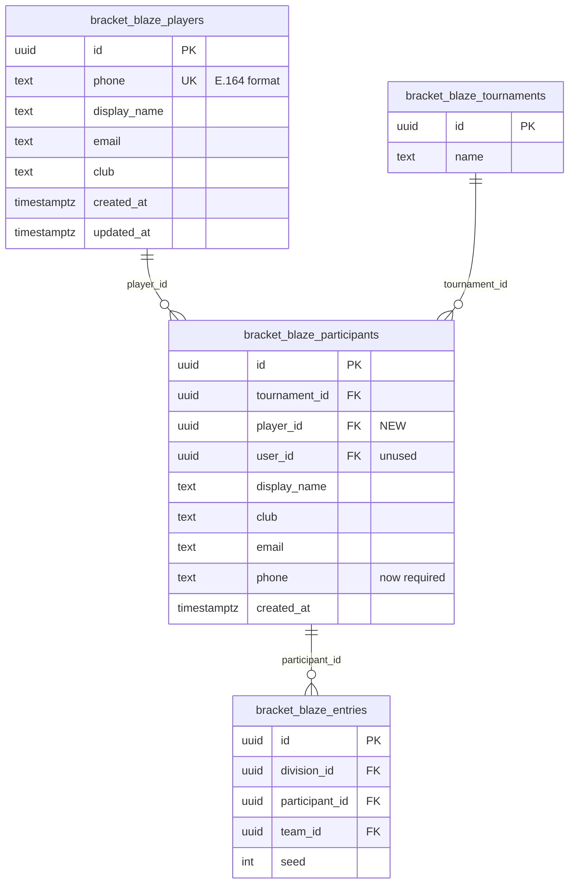

# feat: Global Player Registry

## Overview

Add a global player registry (`bracket_blaze_players`) that gives every player a persistent identity across tournaments, uniquely keyed by phone number in E.164 format. Tournament-scoped participants gain a `player_id` FK linking them to their global identity, enabling cross-tournament recognition, pre-fill on add, and a foundation for future ratings/seeding.

## Problem Statement

Today, participants are fully tournament-scoped. The same person playing in three tournaments exists as three unrelated database records with no connection. TDs re-enter player details every tournament. There's no way to track a player's history, carry forward seeding, or even recognize returning players. This creates redundant data entry and blocks future features like ratings, player profiles, and self-registration.

## Proposed Solution

Add a new `bracket_blaze_players` table as the global identity layer. Link existing `bracket_blaze_participants` to it via a `player_id` FK. Phone number (E.164 normalized, +91 default) becomes the canonical unique identifier. TDs still create participants the same way, but the system auto-links to the global registry behind the scenes.

(see brainstorm: docs/brainstorms/2026-02-26-global-player-registry-brainstorm.md)

## Technical Approach

### Architecture

```
bracket_blaze_players (NEW - global identity)
  │
  ├── id (UUID, PK)
  ├── phone (TEXT, UNIQUE, NOT NULL) — E.164 format, canonical identity
  ├── display_name (TEXT, NOT NULL)
  ├── email (TEXT, nullable)
  ├── club (TEXT, nullable)
  ├── created_at (TIMESTAMPTZ, NOT NULL, default NOW())
  └── updated_at (TIMESTAMPTZ, NOT NULL, default NOW())

bracket_blaze_participants (MODIFIED)
  │
  ├── ... existing columns ...
  ├── player_id (UUID, FK → players, NOT NULL) — NEW
  └── phone (TEXT, NOT NULL) — changed from optional to required
       └── UNIQUE(tournament_id, player_id)
```

#### ERD



### Key Design Decisions

| Decision | Choice | Rationale |
|---|---|---|
| Phone normalization | E.164 with +91 default | Unambiguous, international-ready, covers Indian market |
| Phone mutability | Immutable after creation | Avoids identity reassignment. Delete + re-add if wrong. |
| Global record updates | Last-write-wins | Any TD editing a participant updates the global player record |
| `player_id` nullability | NOT NULL (via phased migration) | Clean data guarantee. Nullable during migration, then tightened. |
| Tournament uniqueness | `UNIQUE(tournament_id, player_id)` | Prevents same person added twice to a tournament |
| Backfill UX | Blocking modal | Forces TDs to add phone numbers to phoneless participants |
| Concurrency safety | `INSERT ... ON CONFLICT` | Atomic find-or-create for global players |
| Participant display name | Tournament-scoped (local) | Global record is source for pre-fill; local overrides for display |
| Deletion behavior | Participant deleted, player persists | Global identity survives tournament cleanup |

### Implementation Phases

#### Phase 1: Database Schema & Migration

**Goal**: Create the `bracket_blaze_players` table, add `player_id` to participants, backfill existing data.

**Tasks:**

- [x] Create `normalizePhone()` utility function
  - File: `lib/utils/phone.ts` (new)
  - Strip all non-digit characters except leading `+`
  - If no country code (no `+`), prepend `+91`
  - If starts with `0`, strip leading `0` and prepend `+91`
  - Validate result matches E.164 pattern: `^\+[1-9]\d{6,14}$`
  - Export for use in validation, server actions, and migration

- [x] Write Supabase migration: `create_players_table`
  - File: `supabase/migrations/YYYYMMDDHHMMSS_create_players_table.sql`
  - Create `bracket_blaze_players` table with columns: `id`, `phone` (UNIQUE), `display_name`, `email`, `club`, `created_at`, `updated_at`
  - Add `updated_at` trigger (same pattern as other tables)
  - Enable RLS on the table
  - Add RLS policies:
    - SELECT: authenticated users only (`auth.role() = 'authenticated'`)
    - INSERT: authenticated users only
    - UPDATE: authenticated users only (last-write-wins via server actions)
    - DELETE: none (global players are never deleted)

- [x] Write Supabase migration: `add_player_id_to_participants`
  - File: `supabase/migrations/YYYYMMDDHHMMSS_add_player_id_to_participants.sql`
  - Add `player_id UUID REFERENCES bracket_blaze_players(id)` — **nullable initially**
  - Add index: `idx_bracket_blaze_participants_player ON bracket_blaze_participants(player_id)`
  - Add unique constraint: `UNIQUE(tournament_id, player_id)` where `player_id IS NOT NULL`
  - Create a Postgres function `find_or_create_player(p_phone TEXT, p_display_name TEXT, p_email TEXT, p_club TEXT)` that:
    ```sql
    INSERT INTO bracket_blaze_players (phone, display_name, email, club)
    VALUES (p_phone, p_display_name, p_email, p_club)
    ON CONFLICT (phone) DO UPDATE SET
      display_name = EXCLUDED.display_name,
      email = EXCLUDED.email,
      club = EXCLUDED.club,
      updated_at = NOW()
    RETURNING id;
    ```
    (This handles both find-or-create AND last-write-wins in one atomic operation)

- [x] Write Supabase migration: `backfill_players_from_participants`
  - File: `supabase/migrations/YYYYMMDDHHMMSS_backfill_players_from_participants.sql`
  - Define a SQL helper function `normalize_phone_e164(raw TEXT)` in the migration:
    - Strip all non-digit characters: `regexp_replace(raw, '[^0-9]', '', 'g')`
    - If result starts with `0`, strip leading `0`
    - Prepend `+91` if no country code (result is 10 digits)
    - Prepend `+` if result starts with `91` and is 12 digits
    - This mirrors the TypeScript `normalizePhone()` logic but runs in Postgres
  - For participants WITH phone numbers:
    - Normalize phone via `normalize_phone_e164(phone)`
    - Insert into `bracket_blaze_players` using `INSERT ... ON CONFLICT (phone) DO NOTHING` (backfill should NOT overwrite existing global records)
    - Set `player_id` on participants by joining on normalized phone
  - For participants WITHOUT phone numbers: leave `player_id` as NULL (handled by blocking modal)
  - Make `participants.phone` NOT NULL only for new rows (handled at app layer, not DB, until backfill complete)

- [ ] Write Supabase migration (deferred): `tighten_player_id_not_null`
  - **Run manually after all TDs have backfilled their phoneless participants**
  - `ALTER TABLE bracket_blaze_participants ALTER COLUMN player_id SET NOT NULL;`
  - `ALTER TABLE bracket_blaze_participants ALTER COLUMN phone SET NOT NULL;`

#### Phase 2: TypeScript Types & Validation

**Goal**: Update types, validation schemas, and add the phone normalization utility.

**Tasks:**

- [x] Update `Participant` interface in `types/database.ts:74-82`
  - Add `player_id: string | null`
  - Add `tournament_id: string` (existing bug fix — this field exists in DB but is missing from the type)

- [x] Add `Player` interface in `types/database.ts`
  ```typescript
  export interface Player {
    id: string
    phone: string
    display_name: string
    email: string | null
    club: string | null
    created_at: string
    updated_at: string
  }
  ```

- [x] Update `participantSchema` in `lib/validations/tournament.ts:70-75`
  - Change `phone` from optional to required with format validation:
    ```typescript
    phone: z.string()
      .min(1, "Phone number is required")
      .max(20)
      .transform(normalizePhone)
      .refine(isValidE164, "Invalid phone number format"),
    ```

- [x] Add `TABLE_NAMES.PLAYERS` constant in table names config

#### Phase 3: Server Actions

**Goal**: Update participant CRUD to integrate with the global player registry.

**Tasks:**

- [x] Create `lib/actions/players.ts` (new)
  - `findPlayerByPhone(phone: string): Promise<Player | null>` — normalize phone, query players table
  - `findOrCreatePlayer(phone, displayName, email, club): Promise<Player>` — call the Postgres `find_or_create_player()` function via `supabase.rpc()`

- [x] Update `createParticipant()` in `lib/actions/participants.ts:8-52`
  - Accept phone as required field
  - Normalize phone with `normalizePhone()`
  - Call `findOrCreatePlayer()` to get/create global player
  - Insert participant with `player_id` from the returned player
  - On duplicate `(tournament_id, player_id)` constraint violation: return error "This player is already in this tournament"

- [x] Update `updateParticipant()` in `lib/actions/participants.ts:54-98`
  - **Remove phone from editable fields** (phone is immutable after creation)
  - Update participant's `display_name`, `club`, `email`
  - Also update the linked `bracket_blaze_players` record with the same values (last-write-wins)
  - Fetch `player_id` from participant, then update the player row

- [x] Update `deleteParticipant()` in `lib/actions/participants.ts:100-134`
  - No changes needed — participant is deleted, global player persists (no cascade to players table)

- [x] Add `getUnlinkedParticipants(tournamentId): Promise<Participant[]>` in `lib/actions/participants.ts`
  - Returns participants where `player_id IS NULL` for the blocking modal

#### Phase 4: UI Changes

**Goal**: Redesign participant dialog as phone-first, add backfill blocking modal.

**Tasks:**

- [x] Redesign `ParticipantDialog` in `components/participants/participant-dialog.tsx`
  - **Phone-first flow**:
    1. Phone input is the first and initially only visible field
    2. On blur (or after typing 10+ digits), trigger lookup via `findPlayerByPhone()`
    3. Show loading spinner during lookup
    4. **If player found**: Show pre-filled name/club/email with a "Known player" indicator. Fields are editable (overrides apply to tournament participant only, but also update global via last-write-wins).
    5. **If not found**: Show empty form fields for TD to fill in
    6. Submit creates participant (which auto-creates/links global player)
  - **Edit mode**: Phone field is read-only (immutable). Other fields editable as before.
  - Remove the "(Optional)" label from phone field

- [x] Update `ParticipantList` in `components/participants/participant-list.tsx`
  - Show a warning badge on participants where `player_id IS NULL`
  - Show phone number more prominently (it's now the primary identifier)

- [x] Create `BackfillModal` component (new)
  - File: `components/participants/backfill-modal.tsx`
  - Shown when TD opens **any tournament page** (participants, divisions, entries, control center) if that tournament has participants with `player_id IS NULL`
  - Lists all phoneless participants with inline phone input fields
  - TD enters phone for each, system auto-links
  - "Save All" button processes all at once
  - Cannot be dismissed — must resolve all or navigate away from tournament
  - Modal title: "Phone numbers required — X players need updating"

- [x] Update tournament layout `app/tournaments/[id]/layout.tsx` (or participants page if no shared layout)
  - Check for unlinked participants on load
  - Render `BackfillModal` if any exist — blocks all tournament sub-pages until resolved

- [x] Update entry management page `app/tournaments/[id]/divisions/[divisionId]/entries/page.tsx`
  - The "available participants" dropdown already works via tournament_id — no changes needed
  - But verify participants with `player_id = NULL` are excluded from new entry creation

## System-Wide Impact

### Interaction Graph

- `createParticipant()` → `findOrCreatePlayer()` (new) → `bracket_blaze_players` INSERT/ON CONFLICT → `bracket_blaze_participants` INSERT
- `updateParticipant()` → updates `bracket_blaze_participants` → updates `bracket_blaze_players` (last-write-wins)
- `deleteParticipant()` → deletes `bracket_blaze_participants` → cascades to entries → no effect on `bracket_blaze_players`
- Entry creation: unchanged (still links through `participant_id`)
- Conflict detection: unchanged (still resolves through `participant_id`)
- Display names: unchanged (still reads from `participants.display_name`)

### Error Propagation

- `findOrCreatePlayer()` uses atomic `ON CONFLICT` — no race condition possible
- If player creation fails (e.g., invalid phone), participant creation is aborted before insert
- If participant insert fails after player creation (e.g., duplicate `(tournament_id, player_id)`), the global player harmlessly persists
- No cleanup needed on partial failure — the global player table is append-only

### State Lifecycle Risks

- **Orphaned players**: Global players with no linked participants. Harmless — they serve as a lookup cache for future tournaments.
- **Stale global data**: Mitigated by last-write-wins — most recent TD edit refreshes the global record.
- **Backfill window**: Between migration and TD backfill, some participants have `player_id = NULL`. The blocking modal prevents normal operations until resolved.

### API Surface Parity

- Server actions are the only mutation interface (no direct API). All changes go through `lib/actions/participants.ts` and new `lib/actions/players.ts`.
- Supabase joins that select `participant:bracket_blaze_participants(*)` will automatically include `player_id` — no join changes needed.

### Integration Test Scenarios

1. **Create participant with new phone** → global player created → participant linked → phone normalized to E.164
2. **Create participant with existing phone** → existing global player found → participant linked → global record updated (last-write-wins) → no duplicate player
3. **Two TDs create same phone simultaneously** → `ON CONFLICT` handles race → both participants link to same global player
4. **Add same phone twice to same tournament** → second insert fails with `UNIQUE(tournament_id, player_id)` → user sees "Player already in this tournament"
5. **Delete participant** → participant and entries deleted → global player persists → phone can be re-added to same tournament

## Acceptance Criteria

### Functional Requirements

- [ ] New `bracket_blaze_players` table exists with phone as unique key (E.164 format)
- [ ] All new participants require a phone number
- [ ] Phone is normalized to E.164 (+91 default) before storage and lookup
- [ ] Entering a known phone auto-links to existing global player and pre-fills form
- [ ] Entering a new phone creates a global player record
- [ ] Same phone cannot be added twice to the same tournament (UNIQUE constraint)
- [ ] Phone is immutable after participant creation (read-only in edit mode)
- [ ] Editing participant name/club/email also updates the global player record
- [ ] Deleting a participant does not delete the global player
- [ ] Blocking modal appears for tournaments with phoneless participants
- [ ] Blocking modal allows batch phone entry and auto-linking
- [ ] All existing participants with phone numbers are backfilled to global players via migration

### Non-Functional Requirements

- [ ] RLS policies on `bracket_blaze_players` restrict access to authenticated users
- [ ] Phone normalization is consistent across all code paths (validation, creation, lookup, migration)
- [ ] `find_or_create_player` is atomic (no race conditions on concurrent creation)
- [ ] Participant page loads in <2s even with global player lookups

### Quality Gates

- [ ] `normalizePhone()` has unit tests covering: 10-digit Indian, +91 prefix, 0-prefix, spaces/dashes, invalid inputs
- [ ] Migration runs cleanly on existing data (tested against production snapshot)
- [ ] TypeScript types match database schema (including `tournament_id` bug fix)

## Dependencies & Prerequisites

- No external dependencies (all Supabase + Next.js, already in the stack)
- Requires knowing the current state of production data (how many participants lack phone numbers)
- The "tighten NOT NULL" migration is deferred until all TDs have completed backfill

## Risk Analysis & Mitigation

| Risk | Likelihood | Impact | Mitigation |
|---|---|---|---|
| Phone format edge cases (international numbers, landlines) | Medium | Medium | E.164 normalization + validation catches most. Log failures for review. |
| TDs don't complete backfill promptly | Medium | Low | Blocking modal forces it. Tournament is unusable until resolved. |
| Same person with two different phone numbers | Medium | Low | Unavoidable without phone verification. Future: merge player records. |
| Migration fails on existing data | Low | High | Test migration against production snapshot first. Make `player_id` nullable initially. |
| RLS too restrictive for future features | Low | Low | Start restrictive, loosen as needed for player self-service. |

## Files Changed

### New Files
| File | Purpose |
|---|---|
| `lib/utils/phone.ts` | `normalizePhone()` and `isValidE164()` utilities |
| `lib/actions/players.ts` | `findPlayerByPhone()`, `findOrCreatePlayer()` server actions |
| `components/participants/backfill-modal.tsx` | Blocking modal for phoneless participant backfill |
| `supabase/migrations/*_create_players_table.sql` | Create `bracket_blaze_players` table + RLS + trigger |
| `supabase/migrations/*_add_player_id_to_participants.sql` | Add `player_id` FK + index + unique constraint + `find_or_create_player()` function |
| `supabase/migrations/*_backfill_players_from_participants.sql` | Backfill existing participants → global players |

### Modified Files
| File | Changes |
|---|---|
| `types/database.ts` | Add `Player` interface, add `player_id` and `tournament_id` to `Participant` |
| `lib/validations/tournament.ts` | Make phone required, add E.164 normalization + validation |
| `lib/actions/participants.ts` | Integrate `findOrCreatePlayer()` in create, make phone read-only in update, add `getUnlinkedParticipants()` |
| `components/participants/participant-dialog.tsx` | Phone-first flow with async lookup and pre-fill |
| `components/participants/participant-list.tsx` | Warning badge on unlinked participants, phone display |
| `app/tournaments/[id]/participants/page.tsx` | Check for unlinked participants, render backfill modal |

### Unchanged (Verified)
| File | Why No Changes |
|---|---|
| `lib/actions/entries.ts` | Entries reference `participant_id`, not `player_id` — unchanged |
| `lib/actions/court-assignments.ts` | Conflict detection uses `participant_id` — unchanged. `UNIQUE(tournament_id, player_id)` guarantees 1:1 mapping within a tournament. |
| `lib/utils/display-name.ts` | Display names come from `participants.display_name` — unchanged |
| All match/scoring/TV/live pages | They read through entries → participants — unchanged |

## Future Considerations

- **Player self-registration**: Add `user_id` FK to `bracket_blaze_players`, link to `auth.users` when a player creates an account with their phone
- **Ratings engine**: Calculate from `player → participants → entries → matches` chain
- **Player profiles**: Query all participants by `player_id` to build tournament history
- **Player merge**: Admin tool to merge two global player records (different phones, same person)
- **Bulk import**: CSV upload to pre-populate the global registry

## Sources & References

### Origin

- **Brainstorm document**: [docs/brainstorms/2026-02-26-global-player-registry-brainstorm.md](docs/brainstorms/2026-02-26-global-player-registry-brainstorm.md) — Key decisions carried forward: phone as canonical identity, keep both layers (players + participants), TDs create records, auto-link with no override, ratings deferred

### Internal References

- Participant schema: `supabase/migrations/20250101000002_add_prefix.sql:72-80`
- Tournament scoping migration: `supabase/migrations/20250102000001_add_tournament_id_to_participants.sql`
- RLS policies: `supabase/migrations/20250101000003_rls_policies_prefixed.sql:104-115`
- Participant server actions: `lib/actions/participants.ts`
- Participant dialog: `components/participants/participant-dialog.tsx`
- Participant list: `components/participants/participant-list.tsx`
- Participant types: `types/database.ts:74-82`
- Validation: `lib/validations/tournament.ts:70-75`
- Entry creation (singles): `lib/actions/entries.ts:7-88`
- Entry creation (doubles): `lib/actions/entries.ts:90-229`
- Conflict detection: `lib/actions/court-assignments.ts:23-176`
- Display name utility: `lib/utils/display-name.ts`
- Batch patterns: `docs/solutions/2026-02-22-n1-query-performance-analysis.md`
