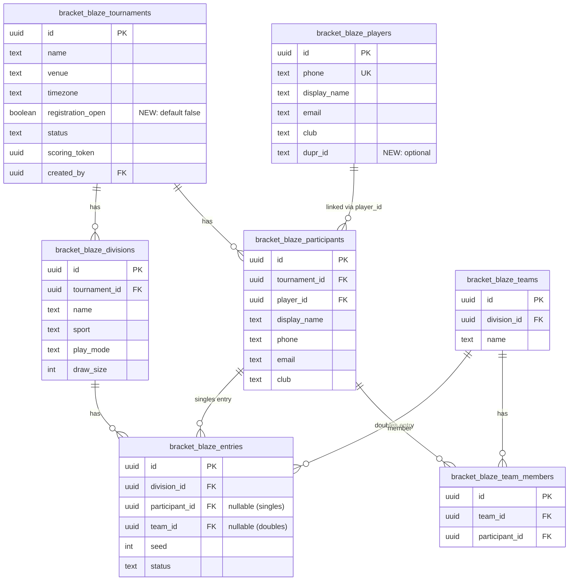

# feat: Player Self-Registration for Tournaments

## Overview

A public registration page at `/register/[tournamentId]` where players sign up for tournaments and select divisions without needing an account. Phone-first flow: enter phone, auto-fill from global player registry if known, select one or more divisions, provide partner details for doubles, submit. A single SECURITY DEFINER RPC handles all writes atomically.

## Problem Statement

Currently, participant registration is entirely TD-driven. The TD manually adds each participant and creates entries for divisions. For tournaments with 100+ players, this is a bottleneck. Players cannot self-register, cannot see available spots, and cannot pre-register before tournament day.

## Proposed Solution

### Architecture

Two SECURITY DEFINER Postgres RPCs handle the public registration flow, following the established pattern from the scoring system (`bracket_blaze_score_point`, etc.):

1. **`bracket_blaze_registration_lookup`** — Phone lookup + tournament/division data. Returns tournament info, available divisions with spots remaining, existing registrations (for re-visit), and pre-filled player data if phone matches. Called on page load (without phone) and on phone entry.

2. **`bracket_blaze_register_for_tournament`** — Atomic registration. Creates global player record (find-or-create), tournament participant, entries for selected divisions, teams + team_members for doubles divisions. Uses `FOR UPDATE` row locking on divisions for race-safe capacity checks.

Both RPCs are `SECURITY DEFINER` and `GRANT`ed to the `anon` role. No RLS policy changes needed — the RPCs bypass RLS.

### User Flow

```
Player visits /register/[tournamentId]
  │
  ├─ Page loads → RPC returns tournament name, venue, divisions with spots
  │  (If registration_open = false → "Registration closed" message)
  │
  ├─ Player enters phone number → blur triggers lookup RPC
  │  ├─ Known player → pre-fill name, email, DUPR ID
  │  ├─ Known player + already in tournament → show existing registrations
  │  └─ Unknown phone → blank form for name, email
  │
  ├─ Player fills name, email (DUPR if pickleball division selected)
  │  Selects one or more divisions (already-entered divisions disabled)
  │  For each doubles division → partner name + phone fields appear
  │
  ├─ Submit → registration RPC (atomic)
  │  ├─ Success → confirmation screen with all registrations
  │  └─ Error → form retains state, shows error (e.g., "Men's Singles is full")
  │
  └─ Re-visit → phone lookup shows existing + allows adding more divisions
```

### Implementation Phases

#### Phase 1: Database Foundation

- [x] **Migration: Add `registration_open` to tournaments** `supabase/migrations/YYYYMMDDHHMMSS_add_registration_open.sql`
  ```sql
  ALTER TABLE bracket_blaze_tournaments
    ADD COLUMN registration_open BOOLEAN NOT NULL DEFAULT false;
  ```

- [x] **Migration: Add `dupr_id` to players** `supabase/migrations/YYYYMMDDHHMMSS_add_dupr_id_to_players.sql`
  ```sql
  ALTER TABLE bracket_blaze_players ADD COLUMN dupr_id TEXT;
  ```

- [x] **Migration: Add unique index on entries** `supabase/migrations/YYYYMMDDHHMMSS_add_entries_unique_index.sql`
  ```sql
  CREATE UNIQUE INDEX idx_bracket_blaze_entries_division_participant
    ON bracket_blaze_entries(division_id, participant_id)
    WHERE participant_id IS NOT NULL;
  ```

- [x] **Migration: Drop participant name uniqueness constraint** `supabase/migrations/YYYYMMDDHHMMSS_drop_participant_name_unique.sql`
  The existing `idx_bracket_blaze_participants_unique_name` on `(tournament_id, LOWER(display_name))` would block partner auto-creation when two people share a common name (e.g., "Rahul Sharma"). The `idx_bracket_blaze_participants_tournament_player` constraint on `(tournament_id, player_id)` is sufficient to prevent true duplicates.
  ```sql
  DROP INDEX IF EXISTS idx_bracket_blaze_participants_unique_name;
  ```

- [x] **Update TypeScript types** `types/database.ts`
  - Add `registration_open: boolean` to `Tournament` interface
  - Add `dupr_id: string | null` to `Player` interface

#### Phase 2: Registration RPCs

- [x] **Migration: Create `bracket_blaze_registration_lookup` RPC** `supabase/migrations/YYYYMMDDHHMMSS_registration_rpcs.sql`

  Signature:
  ```sql
  bracket_blaze_registration_lookup(
    p_tournament_id UUID,
    p_phone TEXT DEFAULT NULL  -- optional, for returning player lookup
  )
  RETURNS JSONB
  ```

  Returns:
  ```jsonc
  {
    "tournament": { "id", "name", "venue", "timezone", "registration_open" },
    "divisions": [
      {
        "id", "name", "sport", "play_mode", "format",
        "draw_size", "entry_count", "spots_remaining"
      }
    ],
    // Only present if p_phone provided and found:
    "player": { "display_name", "email", "club", "dupr_id" },
    // Only present if player already has a participant in this tournament:
    "existing_entries": [
      { "division_id", "division_name", "play_mode", "team_name" }
    ]
  }
  ```

  Logic:
  1. Fetch tournament, check `status IN ('draft', 'active')` and `registration_open = true`
  2. Fetch all divisions for the tournament with entry counts (regardless of `is_published` — registration shows all divisions, see brainstorm)
  3. If `p_phone` provided: normalize using `bracket_blaze_normalize_phone_e164`, lookup in `bracket_blaze_players`, return player data
  4. If player found and has a participant in this tournament: fetch their existing entries (including team-based entries via `bracket_blaze_team_members` join)
  5. `SECURITY DEFINER`, granted to `anon` + `authenticated`

- [x] **Migration: Create `bracket_blaze_register_for_tournament` RPC** (same migration file)

  Signature:
  ```sql
  bracket_blaze_register_for_tournament(
    p_tournament_id UUID,
    p_phone TEXT,
    p_display_name TEXT,
    p_email TEXT,
    p_dupr_id TEXT DEFAULT NULL,
    p_registrations JSONB
    -- Format: [
    --   { "division_id": "uuid", "type": "singles" },
    --   { "division_id": "uuid", "type": "doubles",
    --     "partner_name": "Name", "partner_phone": "+91..." }
    -- ]
  )
  RETURNS JSONB
  ```

  Logic (atomic, inside single transaction):
  1. **Validate tournament**: Check `registration_open = true` and `status IN ('draft', 'active')`. Lock tournament row with `FOR UPDATE`.
  2. **Normalize phone**: Use `bracket_blaze_normalize_phone_e164(p_phone)`.
  3. **Find-or-create registrant player**: `INSERT INTO bracket_blaze_players ... ON CONFLICT (phone) DO UPDATE SET` (last-write-wins for registrant's own data, including `dupr_id`).
  4. **Find-or-create registrant participant**: Check if participant exists for this tournament + player_id. If yes, reuse. If no, insert.
  5. **Lock and validate each division**: `SELECT ... FOR UPDATE` on each requested division. Check:
     - Division belongs to this tournament
     - Division has capacity (`entry_count < draw_size`)
     - Registrant not already entered in this division
  6. **For each singles division**: Insert entry with `participant_id`, `seed = NULL`, `status = 'active'`.
  7. **For each doubles division**:
     a. Normalize partner phone, find-or-create partner player (fill-NULLs-only strategy — see Partner Data Protection below).
     b. Find-or-create partner participant in this tournament.
     c. Check partner not already in a team in this division.
     d. Check registrant not already in a team in this division.
     e. Create team (`bracket_blaze_teams`), two team_members, entry with `team_id`, `seed = NULL`, `status = 'active'`.
  8. **Return**: Confirmation JSONB with created entries.
  9. **On any failure**: `RAISE EXCEPTION` with descriptive message. Transaction auto-rolls back (all-or-nothing, see brainstorm).
  10. `SECURITY DEFINER`, granted to `anon` + `authenticated`.

  **Critical: Partner data protection** — Two different conflict strategies:
  - **Registrant's own record**: `ON CONFLICT (phone) DO UPDATE SET display_name = EXCLUDED.display_name, email = EXCLUDED.email, dupr_id = EXCLUDED.dupr_id` — last-write-wins, since the player is providing their own data.
  - **Partner records**: `ON CONFLICT (phone) DO UPDATE SET display_name = COALESCE(bracket_blaze_players.display_name, EXCLUDED.display_name), email = COALESCE(bracket_blaze_players.email, EXCLUDED.email), dupr_id = COALESCE(bracket_blaze_players.dupr_id, EXCLUDED.dupr_id)` — fill NULL fields only, never overwrite existing values. This prevents a third party from corrupting a known player's profile by entering their phone number.

#### Phase 3: Public Registration Page

- [x] **Add `/register/` to middleware exclusion** `middleware.ts`
  ```typescript
  // Add register/ to the negative lookahead
  '/((?!_next/static|_next/image|favicon.ico|tv/|score/|live/|register/|.*\\.(?:svg|png|jpg|jpeg|gif|webp)$).*)'
  ```

- [x] **Create server page** `app/register/[tournamentId]/page.tsx`
  - Call `bracket_blaze_registration_lookup(tournamentId)` via server Supabase client (anon)
  - If tournament not found or registration closed → show appropriate message
  - Pass tournament data, divisions, supabaseUrl, supabaseAnonKey to client component
  - Metadata: tournament name in page title

- [x] **Create registration form client component** `components/register/registration-form.tsx`
  - Uses `createClient` from `@supabase/supabase-js` directly (matching scoring/TV/live pattern)
  - **Phone-first flow**:
    1. Phone input with `onBlur` handler → calls `bracket_blaze_registration_lookup` with phone
    2. If known player: pre-fill name, email, DUPR. Show "Welcome back" indicator
    3. If already in tournament: show existing registrations, disable those division checkboxes
    4. If unknown: show empty name/email fields
  - **Division selection**: Checkboxes for each division showing name, sport badge, play_mode badge, spots remaining (e.g., "12/16")
  - **DUPR field**: Appears when any selected division has `sport = 'pickleball'`
  - **Partner fields**: For each selected doubles division, show partner name + phone inputs
  - **Form validation**: Zod schema on client side — phone required, name required, email required (unlike the TD flow where email is optional, self-registration requires email for player communication), partner name + phone required for each selected doubles division
  - **Submit**: Calls `bracket_blaze_register_for_tournament` RPC
  - **Error handling**: Show inline error (e.g., "Men's Singles is full — deselect it and try again"). Form retains all entered data.
  - **Success**: Show confirmation component

- [x] **Create confirmation component** `components/register/registration-confirmation.tsx`
  - Tournament name, venue
  - List of registered divisions with partner names (for doubles)
  - "You're all set" message

#### Phase 4: TD Registration Controls

- [x] **Add registration toggle to tournament settings** `components/control-center/control-center-client.tsx`
  - Toggle button for `registration_open` in control center toolbar
  - When toggled on: copies registration URL to clipboard, shows "Copy Registration Link" button
  - When toggled off: shows "Open Registration" button

- [x] **Server action for toggling registration** `lib/actions/tournaments.ts`
  ```typescript
  export async function toggleRegistration(tournamentId: string, open: boolean)
  ```

- [x] **Update `bracket_blaze_find_or_create_player` to include `dupr_id`** `supabase/migrations/...`
  The existing RPC needs an optional `p_dupr_id` parameter so the TD participant creation flow also handles DUPR IDs.

## Alternative Approaches Considered

1. **Server Action + Service Role** — Easier TypeScript but not atomic without manual transaction management. Diverges from the SECURITY DEFINER pattern established by the scoring system. (see brainstorm: docs/brainstorms/2026-02-28-player-self-registration-brainstorm.md)

2. **Hybrid (reads via RLS, writes via RPC)** — Cleaner separation but divisions are RLS-blocked for anon users (unpublished divisions not visible). Would require RLS policy changes. The pure RPC approach avoids touching RLS. (see brainstorm)

3. **Require player accounts** — Would provide identity verification but adds significant friction. The phone-first approach matches the existing codebase pattern. Player accounts can be added later as an enhancement.

## System-Wide Impact

### Interaction Graph

```
Player submits registration form
  → Client calls bracket_blaze_register_for_tournament RPC (anon)
    → RPC locks tournament row (FOR UPDATE)
    → RPC calls bracket_blaze_normalize_phone_e164 (existing SQL function)
    → RPC INSERTs into bracket_blaze_players (ON CONFLICT for registrant, DO NOTHING for partner)
    → RPC INSERTs into bracket_blaze_participants
    → RPC locks division rows (FOR UPDATE) for capacity check
    → RPC INSERTs into bracket_blaze_entries
    → (For doubles) RPC INSERTs into bracket_blaze_teams, bracket_blaze_team_members
    → Returns JSONB confirmation
```

TD-side: The admin participant list and entry list will show self-registered players immediately. No changes needed to admin UI for viewing — existing queries already fetch all participants/entries.

### Error & Failure Propagation

- **Postgres RAISE EXCEPTION** → Supabase returns as RPC error → Client shows toast/inline error
- **All-or-nothing**: Any failure (capacity, duplicate, closed registration) rolls back entire transaction
- Error messages are human-readable strings from `RAISE EXCEPTION`:
  - `"Registration for this tournament is closed"`
  - `"Division 'Men's Singles' is full (16/16)"`
  - `"You are already registered in 'Men's Singles'"`
  - `"Your partner is already in a team in 'Mixed Doubles'"`
  - `"Invalid phone number format"`

### State Lifecycle Risks

- **Atomic RPC eliminates partial state**: No orphaned participants without entries, no entries without participants. The entire registration succeeds or fails as one transaction.
- **Division row locking** (`FOR UPDATE`): Prevents capacity overflow from concurrent registrations. Two simultaneous submits for the last spot → one succeeds, one gets "division full" error.
- **Tournament row locking**: Prevents registration succeeding after TD closes registration.
- **Idempotency concern**: If a player submits twice due to network issues, the second call would find existing participant/entries and either skip or raise "already registered." The RPC should handle this gracefully — check for existing entries before creating.

### API Surface Parity

| Action | Current Interface | Self-Registration Interface |
|--------|------------------|---------------------------|
| Create participant | TD: `createParticipant()` server action | RPC: `bracket_blaze_register_for_tournament` |
| Create entry (singles) | TD: `createEntry()` server action | Same RPC (atomic) |
| Create entry (doubles) | TD: `createDoubleEntry()` server action | Same RPC (atomic) |
| Find-or-create player | TD: `findOrCreatePlayer()` server action → RPC | Same RPC (inline) |
| Phone lookup | TD: `findPlayerByPhone()` server action | RPC: `bracket_blaze_registration_lookup` |

Both paths ultimately write to the same tables. The admin UI will see self-registered players in the existing participant and entry lists.

## Acceptance Criteria

### Functional Requirements

- [ ] Public page at `/register/[tournamentId]` loads without authentication
- [ ] Phone input triggers player lookup on blur; pre-fills name/email/DUPR if known
- [ ] Player can select multiple divisions and submit in one form
- [ ] Doubles divisions show per-division partner fields (name + phone)
- [ ] Registration is atomic — all entries created or none
- [ ] Capacity enforced: cannot exceed `draw_size` per division
- [ ] Re-visit flow: existing registrations shown, already-entered divisions disabled
- [ ] DUPR ID field appears only when a pickleball division is selected
- [ ] TD can toggle `registration_open` on/off
- [ ] Registration URL shown to TD when registration is open
- [ ] Registration form shows "Registration closed" when toggle is off
- [ ] Partner phone triggers find-or-create (partner becomes full participant with player_id)
- [ ] Partner data does NOT overwrite existing global player profiles (security)
- [ ] Confirmation screen shows all registered divisions with partner names

### Non-Functional Requirements

- [ ] Concurrent registration race condition handled via `FOR UPDATE` locking
- [ ] No RLS policy changes needed (RPCs bypass RLS via SECURITY DEFINER)
- [ ] Phone normalization consistent between client (TypeScript) and server (SQL)

### Quality Gates

- [ ] TypeScript build passes (`npx tsc --noEmit`)
- [ ] All existing tests pass
- [ ] Manual test: register new player for singles division
- [ ] Manual test: register returning player (pre-fill works)
- [ ] Manual test: register for doubles with new partner
- [ ] Manual test: register for doubles with known partner (already in registry)
- [ ] Manual test: re-visit shows existing registrations
- [ ] Manual test: division full → error message, form retains state
- [ ] Manual test: registration closed → appropriate message
- [ ] Manual test: concurrent registration does not exceed draw_size

## Dependencies & Risks

**Dependencies**:
- Global Player Registry (PR #3) — merged and deployed
- `bracket_blaze_normalize_phone_e164` SQL function — already deployed (migration `20250106000003`)
- Supabase anon role grants — mechanism already proven by scoring RPCs

**Risks**:
1. **Common name collisions** — Mitigated by dropping the `unique(tournament_id, LOWER(display_name))` constraint. The `unique(tournament_id, player_id)` constraint is sufficient.
2. **Partner data corruption** — Mitigated by using `ON CONFLICT DO NOTHING` (not `DO UPDATE`) for partner player records.
3. **Bot abuse** — Mitigated for V2 with Cloudflare Turnstile. For MVP, the TD can manually remove fake entries.
4. **International phone numbers** — MVP assumes India (+91 default). Document limitation. V2: add country code selector.

## ERD: New/Modified Tables



## Known Limitations (MVP)

- **India-only phone normalization**: 10-digit numbers default to +91. International players must enter full E.164 format (e.g., `+12025551234`).
- **No bot protection**: No CAPTCHA for MVP. TD can remove fake entries manually. V2: Cloudflare Turnstile.
- **No phone verification**: Anyone who knows a phone number can view/add registrations for that player. Low risk for tournaments but noted. V2: OTP verification.
- **No email/SMS confirmation**: On-screen confirmation only.
- **No TD notification**: TD must check participant list manually to see new registrations.
- **Phone enumeration**: The lookup RPC returns player data for any valid phone. Low risk given tournament context.
- **Re-visit cannot withdraw**: Players can only add divisions, not remove. TD handles withdrawals.

## Sources & References

### Origin

- **Brainstorm document:** [docs/brainstorms/2026-02-28-player-self-registration-brainstorm.md](docs/brainstorms/2026-02-28-player-self-registration-brainstorm.md) — Key decisions carried forward: SECURITY DEFINER RPC approach, auto-accept registration, multi-division select, phone-first flow, DUPR on global player.

### Internal References

- Scoring RPC pattern: `supabase/migrations/20250104000001_phase4_scoring_tv.sql`
- Phone normalization (TS): `lib/utils/phone.ts`
- Phone normalization (SQL): `supabase/migrations/20250106000003_backfill_players_from_participants.sql`
- Find-or-create player RPC: `supabase/migrations/20250106000002_add_player_id_to_participants.sql:19`
- Entry creation (singles): `lib/actions/entries.ts:7`
- Entry creation (doubles): `lib/actions/entries.ts:90`
- Middleware exclusion: `middleware.ts:3`
- Public page pattern (scoring): `app/score/[token]/page.tsx`
- Public page pattern (live): `app/live/[tournamentId]/page.tsx`
- Participant dialog (form pattern): `components/participants/participant-dialog.tsx`
- Tightened players RLS: `supabase/migrations/20250106000004_tighten_players_rls.sql`
- Global Player Registry plan: `docs/plans/2026-02-26-feat-global-player-registry-plan.md`
