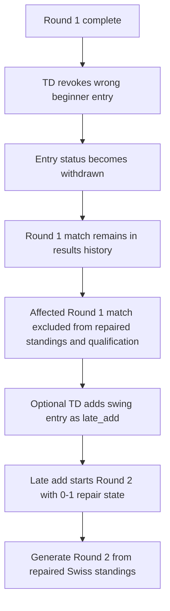
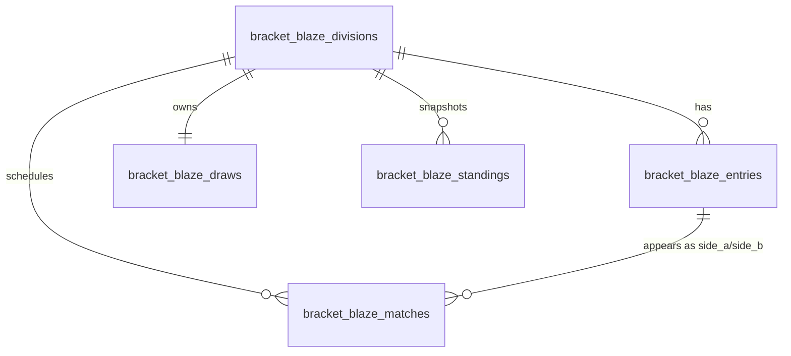

# feat: Add Swiss Reclassification Repair Flow

## Overview

Add a Swiss-only tournament-director repair flow for the specific case where, after Swiss Round 1 completes, one or more entries are determined to be misclassified and must be removed from the division without disturbing the rest of the event.

The chosen behavior is now explicit: revoke the misclassified entry in the current division, keep the already-played Round 1 match visible in results/history, but exclude that match from any standings used for future Swiss draw generation or knockout qualification. Optionally, add a swing/replacement entry as `late_add` for Round 2 with a starting Swiss record of `0-1` (origin: `docs/brainstorms/2026-03-06-swiss-mid-event-reclassification-brainstorm.md`, refined in review).

This is intentionally narrow. It is not a general redraw system, not a replay workflow, and not an automatic transfer flow into the destination division.

## Problem Statement

The current codebase has the primitives needed for this operator workflow, but not the repair behavior itself:

- `bracket_blaze_entries.status` already supports `withdrawn` and `late_add`, but entry management still hard-deletes rows through `deleteEntry()`, which would erase the audit trail after a draw exists (`lib/actions/entries.ts:288`).
- Swiss Round 1 generation already ignores non-active entries (`lib/services/draw-generators/swiss-engine.ts:57`), which fits the forward-only repair model.
- Swiss standings currently initialize from active entries only, but then re-create rows for any completed-match participant encountered during processing (`lib/services/standings-engine.ts:56-139`). That means a revoked entry can still leak back into rankings and future pairings today.
- `generateNextSwissRound()` builds Round 2 pairings directly from `calculateStandings()`, so any standings ambiguity becomes a draw-generation bug (`lib/actions/draws.ts:303-330`).
- Division capacity checks currently count all entries, including withdrawn ones, so a “revoke 3, add 1 swing” scenario would still appear full (`lib/actions/entries.ts:38-46`, `lib/actions/entries.ts:118-126`).

Without an explicit repair flow, the TD has only two bad options: hard-delete history or let the wrong entries continue affecting later Swiss rounds.

## Proposed Solution

Implement a narrow Swiss-only repair workflow with four coordinated pieces:

1. **Replace post-draw deletion with administrative revocation**
   Once a Swiss draw exists, entry removal should become a status-based operation (`withdrawn`), not a hard delete. This preserves Round 1 match history while removing the entry from future competition.

2. **Introduce explicit Round 2 late-add repair support**
   Allow the TD to add a swing/replacement entry after Round 1 as `late_add`, with a fixed starting state of `0-1`, and only for future Swiss rounds. This remains a separate explicit TD action; nothing is auto-moved into intermediate.

3. **Separate visible match history from competitive standings**
   The completed Round 1 match remains visible in results/history, but any match involving a revoked entry is excluded from repaired standings, future pairing pools, and knockout qualification.

4. **Constrain the feature to a between-round Swiss repair window**
   For MVP, this flow only applies after Swiss Round 1 is complete and before Round 2 has been generated. That keeps the rule operationally clear and avoids rewriting already-generated future rounds.

## Technical Approach

### Architecture

Use existing entry statuses as the main lifecycle model, and keep Swiss-only repair metadata in draw state rather than expanding the database schema for a single narrow administrative workflow.

Recommended shape:

- `entries.status = 'withdrawn'`
  Used for misclassified entries revoked after Round 1.
- `entries.status = 'late_add'`
  Used for swing/replacement entries that join beginning in Round 2.
- `draw.state_json.swiss_repair`
  Stores per-entry repair metadata needed for Round 2-only behavior, for example:
  - `late_adds[entryId].eligible_from_round = 2`
  - `late_adds[entryId].initial_wins = 0`
  - `late_adds[entryId].initial_losses = 1`
  - `excluded_match_ids = ["..."]`
  - optional `late_adds[entryId].pairing_sort_bucket = "bottom_of_zero_win"`

Why this shape:

- Preserves the brainstorm’s narrow scope and avoids a migration-heavy generalized entry-adjustment model.
- Keeps repair behavior attached to the Swiss draw runtime state, where `current_round`, `bye_history`, qualifiers, and knockout variant already live (`lib/actions/draws.ts:166-172`, `lib/actions/draws.ts:366-369`).
- Avoids inventing a new table for a correction workflow that only exists after a draw has started.
- Leaves room for a future broader entry-adjustment model without blocking this targeted repair flow.

### Operational Flow

### Data Relationships

Repair metadata remains Swiss draw state, not a new relational table.

### Implementation Phases

#### Phase 1: Entry Lifecycle Guardrails

Replace destructive post-draw behavior with explicit Swiss repair actions.

Deliverables:
- Add a server action to revoke a Swiss entry after Round 1 by updating `entries.status` to `withdrawn`
- Restrict hard deletion to pre-draw entry management only
- Add a server action to create a Round 2 `late_add` entry for singles
- Add a server action to create a Round 2 `late_add` entry for doubles
- Update capacity checks so only competition-active entries count against `draw_size`
- Count `active` and `late_add`
- Exclude `withdrawn`
- Keep moved-player insertion into the destination division as a separate existing/manual entry action

Success criteria:
- A TD can revoke an entry after Round 1 without deleting historical matches
- A withdrawn entry no longer blocks adding one swing entry into the same division
- Existing pre-draw add/edit/remove behavior still works

#### Phase 2: Swiss Repair Metadata and Pairing Eligibility

Add a narrow runtime representation for Round 2 late-add behavior.

Deliverables:
- Extend draw state with a `swiss_repair` section for per-entry late-add metadata
- Extend draw state with an explicit excluded-match list for revoked-entry Round 1 matches
- Create helper utilities for:
  - competition-eligible entry statuses
  - round-specific pairing eligibility
  - seeded starting record for late adds (`0-1`)
  - match exclusion for repaired standings / qualification
- Scope this logic to Swiss only and to the Round 1 -> Round 2 handoff
- Reject repair actions when:
  - the division is not Swiss
  - Round 1 is not complete
  - Round 2 already exists
  - the draw is already in knockout phase

Success criteria:
- A `late_add` created through this flow is eligible for Round 2 and not treated as a fresh `0-0` entrant
- A revoked entry is clearly non-eligible for any future Swiss round generation
- The flow is not available in unsupported states

#### Phase 3: Repaired Standings and Future Draw Generation

Make Swiss standings count valid historical results while excluding revoked entries from future competition.

Deliverables:
- Refactor `calculateStandings()` so it can:
  - initialize standings for competition-eligible entries (`active` + repair `late_add`s)
  - exclude revoked-entry Round 1 matches from repaired standings used for future rounds and qualification
  - avoid re-inserting withdrawn entries into the final ranked output
  - seed late-add entries with `0-1` before Round 2 pairing
- Ensure late-add entries sort at the bottom of the `0-win` bucket until they have played a real Swiss match
  - This avoids a replacement entrant jumping ahead of actual Round 1 losers with played point differential
- Use the repaired standings output consistently in:
  - `generateNextSwissRound()`
  - control center standings
  - live portal standings
  - knockout qualification via `getQualifiers()`

Success criteria:
- The Round 1 match remains visible in results/history
- The revoked-entry Round 1 match does not contribute wins, losses, points, or tiebreak data to repaired standings
- Revoked entries do not appear in standings tables, Round 2 pairing pools, or knockout qualifiers
- Round 2 generation works after revoking multiple entries and adding one replacement

#### Phase 4: TD Surface Updates

Expose the repair workflow clearly in the existing operator surfaces.

Deliverables:
- Update `components/entries/entry-list.tsx` so post-draw Swiss entries show the correct action set:
  - `Remove` only before a draw exists
  - `Revoke` once a Swiss draw exists
- Add an explicit `Add Late Add` path for the between-round repair flow
- Show entry badges and contextual copy for:
  - `Withdrawn`
  - `Late Add`
  - Round 2 / `0-1` starting state where relevant
- Add guardrail messaging in the entries UI when repair actions are unavailable because Round 1 is incomplete or Round 2 already exists

Success criteria:
- The TD can understand the difference between deleting, revoking, and late-adding
- The UI does not suggest a destructive action after historical matches exist
- The repair state is visible enough that operators can trust what Round 2 generation will do

#### Phase 5: Testing and Regression Coverage

Add focused coverage for repaired Swiss flows and protect existing Swiss behavior.

Deliverables:
- Unit tests for repaired standings behavior:
  - valid opponent result retained
  - withdrawn entry excluded from output
  - late add seeded as `0-1`
  - late add bottom-of-bucket ordering
- Unit tests for entry-capacity counting with `withdrawn` vs `late_add`
- Integration tests for:
  - revoke one entry after Round 1, generate Round 2
  - revoke multiple entries after Round 1, add one late add, generate Round 2
  - revoke in doubles division
  - qualifier generation after repaired Swiss rounds
- UI-level assertions for revoked / late-add badges and action availability where practical

Success criteria:
- The repaired flow is covered end to end
- Standard Swiss tournaments without revocations behave exactly as before

## Alternative Approaches Considered

### 1. Keep the Round 1 result in repaired standings

Rejected.

Review refinement rejected this interpretation. Keeping the result inside repaired standings would still influence future Swiss pairings and knockout qualification indirectly, which conflicts with the clarified requirement: the match can remain visible in history, but it must not affect future draws.

### 2. Full Round 1 repair / redraw

Rejected.

This is the most disruptive option operationally and directly conflicts with the brainstorm’s forward-only repair decision. It would also require reworking already-played matches, court assignments, and player expectations.

### 3. New database tables or generic per-entry Swiss adjustment columns

Rejected for MVP.

That would support a broader family of mid-event corrections, but it overreaches the narrow user need. Draw-state repair metadata is enough for the Round 1 -> Round 2 repair workflow and keeps scope controlled.

## System-Wide Impact

### Interaction Graph

This feature cuts across entry management, standings, and Swiss round generation:

1. TD opens the division entries screen (`app/tournaments/[id]/divisions/[divisionId]/entries/page.tsx:51-100`)
2. TD revokes one or more misclassified entries instead of hard-deleting them
3. TD optionally adds a swing entry as `late_add`
4. Entries state and draw repair metadata are persisted
5. `calculateStandings()` derives repaired standings from completed Round 1 matches, entry eligibility, and excluded-match repair rules
6. `generateNextSwissRound()` uses those repaired standings to create Round 2 pairings (`lib/actions/draws.ts:303-330`)
7. Control center and live portal read the same repaired standings (`app/tournaments/[id]/control-center/page.tsx:88-95`, `app/live/[tournamentId]/page.tsx:67-74`)
8. Knockout qualification later consumes the same repaired Swiss standings via `getQualifiers()`

The plan must keep those layers aligned so there is one consistent answer to “who still counts in this division?”

### Error & Failure Propagation

Primary failure cases:

- TD tries to revoke while Round 1 is incomplete
- TD tries to revoke after Round 2 already exists
- TD tries to late-add into a full division where only withdrawn rows made it appear full
- Draw state update succeeds but entry update fails, or vice versa
- Repaired standings logic diverges between UI display and Round 2 generation
- Results history and repaired standings disagree in a way that confuses operators

Mitigation:

- Validate state before any repair mutation
- Perform entry-status and draw-state writes in a single transaction boundary if implemented through RPC, or via a carefully ordered server action with rollback behavior
- Centralize repaired-standings logic so pairings, UI standings, and knockout qualification all use the same computation path

### State Lifecycle Risks

Persisted state touched by this feature:

- `bracket_blaze_entries.status`
- `bracket_blaze_draws.state_json`
- `bracket_blaze_standings` round snapshots
- existing `bracket_blaze_matches` history, which must remain intact

Risks:

- Hard delete after draw would orphan historical match references
- Withdrawn entries could still leak into repaired standings if match processing auto-creates them
- Revoked-entry matches could still leak into repaired standings if exclusion is not applied centrally
- `late_add` entries could be shown as `0-0` if repair metadata and standings logic drift apart
- Capacity logic could remain inconsistent if some flows still count withdrawn rows

Mitigation:

- Forbid or hide destructive delete after draw creation
- Treat repaired standings as the single source of truth for pairing and qualification
- Keep all Round 2 late-add assumptions in one helper layer keyed from draw state
- Reuse a shared “competition-active count” helper in every create/late-add path

### API Surface Parity

Interfaces that must agree:

- `lib/actions/entries.ts`
- `components/entries/entry-list.tsx`
- `lib/services/standings-engine.ts`
- `lib/actions/draws.ts`
- `app/tournaments/[id]/control-center/page.tsx`
- `app/live/[tournamentId]/page.tsx`
- `components/control-center/standings-section.tsx`

Interfaces explicitly out of scope:

- automatic beginner -> intermediate transfer
- redraw/replay tooling
- post-Round-2 or knockout-phase repair flows
- general public late registration changes

## SpecFlow Findings

Flow analysis identified a few requirements that must be explicit in the plan:

1. **Role and entry point**
   This is TD/desk-only behavior. The natural entry point is the existing entries page, not the public portal or player registration flow.

2. **State window**
   The feature is safest and clearest if available only between Swiss rounds, specifically after Round 1 completion and before Round 2 generation.

3. **Singles and doubles parity**
   The operator problem exists for both singles and doubles divisions, so both entry creation paths need a repair-mode equivalent.

4. **Standings visibility**
   Revoked entries should disappear from standings views, and any revoked-entry Round 1 match should remain visible only in results/history, not in repaired standings.

5. **Odd/even player counts**
   Revoking multiple entries and adding fewer replacements can produce an odd active field. The existing Swiss bye logic should continue to handle this without special-case UI.

6. **Qualification parity**
   Swiss repair cannot stop at Round 2 generation. If standings are repaired for pairings, the same repaired view must feed knockout qualification later.

## Acceptance Criteria

### Functional Requirements

- [x] After Swiss Round 1 completes, a TD can revoke one or more entries from a Swiss division without deleting their already-played Round 1 match history.
- [x] Revoked entries are excluded from all future Swiss draw generation in that division.
- [x] The affected Round 1 match remains visible in results/history.
- [x] The affected Round 1 match is excluded from any standings used for future Swiss pairings or knockout qualification.
- [x] A TD can add a replacement swing entry as `late_add` for Round 2 only.
- [x] A repair `late_add` starts with a Swiss record of `0-1`.
- [x] Repair `late_add` entries sort at the bottom of the zero-win bracket until they play their first real Swiss match.
- [x] Withdrawn entries do not count toward division capacity for repair additions.
- [x] The flow works for both singles and doubles divisions.
- [x] Adding the revoked team/player to intermediate remains a separate explicit TD action.

### Guardrails

- [x] Repair actions are only available for Swiss divisions.
- [x] Repair actions are only available after Round 1 is complete and before Round 2 exists.
- [x] Post-draw entry management does not offer destructive hard delete.
- [x] Knockout qualification uses the same repaired standings model as Swiss pairing.

### Quality Gates

- [ ] Unit tests cover repaired standings logic and capacity counting
- [ ] Integration tests cover revoke-only and revoke-plus-late-add scenarios
- [ ] Existing Swiss round generation passes regression coverage unchanged when no repair actions are used

## Success Metrics

- TD can correct a misclassified Round 1 Swiss entry without redrawing or replaying the division
- The corrected division can generate Round 2 in under the normal operator flow, with no manual database intervention
- Control center, live portal, and knockout qualification all agree on repaired Swiss standings
- Results/history can continue to show what happened in Round 1 without affecting competitive progression

## Dependencies & Prerequisites

- Existing Swiss draw state and standings infrastructure must remain the base implementation path
- Entry-management UI remains the operator surface for manual correction
- No external research is required; local repo patterns are sufficient for this feature
- No relevant institutional learnings were found in `docs/solutions/` for this domain

## Risk Analysis & Mitigation

### 1. Hidden destructive behavior

Risk:
The current delete action permanently removes entries and would conflict with the historical-fact requirement.

Mitigation:
Split pre-draw delete from post-draw revoke semantics clearly in both action layer and UI.

### 2. Repaired standings drift

Risk:
If pairing logic and UI logic compute eligibility differently, TDs will see one ranking table and get a different Round 2 draw.

Mitigation:
Keep repaired standings centralized in `calculateStandings()` or an adjacent shared helper, and use that same output everywhere.

### 3. Late-add placement fairness

Risk:
A synthetic `0-1` entrant could sort too high if the plan does not define tie handling inside the zero-win bucket.

Mitigation:
Add an explicit bottom-of-bucket rule for Round 2 repair late adds until they play a real match.

### 4. Scope creep into generalized late registration

Risk:
This narrow Swiss repair flow could accidentally turn into a broader “late add at any time” feature.

Mitigation:
Constrain availability to the Round 1 -> Round 2 repair window and document that broader late-registration policy remains out of scope.

## Documentation Plan

- Update operator-facing copy on the entries page to explain revoke vs late add
- If tournament-operations docs exist later, document the Swiss repair window and the `0-1` replacement rule

## Sources & References

### Origin

- **Brainstorm document:** `docs/brainstorms/2026-03-06-swiss-mid-event-reclassification-brainstorm.md`
  Key decisions carried forward:
  - forward-only repair, not redraw
  - Round 1 match remains visible in history but is excluded from repaired standings
  - replacement late adds start at `0-1`
  - moving the player into intermediate is a separate explicit action

### Internal References

- Hard delete today: `lib/actions/entries.ts:288-322`
- Entry creation capacity counting all rows: `lib/actions/entries.ts:38-46`, `lib/actions/entries.ts:118-126`
- Entry statuses in UI: `components/entries/entry-list.tsx:273-278`
- Entries page operator surface: `app/tournaments/[id]/divisions/[divisionId]/entries/page.tsx:51-100`
- Swiss Round 1 active-entry filtering: `lib/services/draw-generators/swiss-engine.ts:57-106`
- Swiss next-round pairing from standings: `lib/actions/draws.ts:303-330`
- Standings currently re-create non-active match participants: `lib/services/standings-engine.ts:56-139`
- Control center standings consumption: `app/tournaments/[id]/control-center/page.tsx:88-95`
- Live portal standings consumption: `app/live/[tournamentId]/page.tsx:67-74`

### External References

- None. Local repository context was sufficient, and this feature does not require time-sensitive external guidance.
