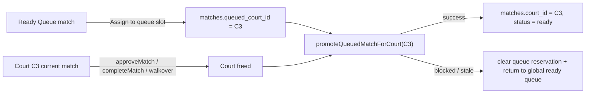
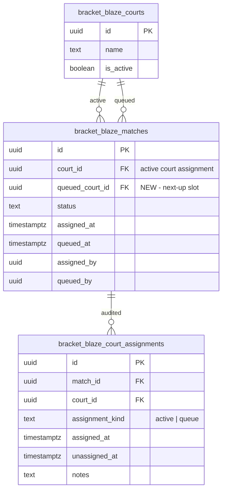

# feat: Add court queue slot auto-promotion

## Overview

Add one reserved "up next" slot per court in the Control Center. A TD should keep the current flow of assigning a match directly to a court, and also be able to place exactly one additional match into that court's queue slot. When the current court match is completed and the court is legitimately freed, the queued match should automatically become the active court assignment.

This is a Phase 3 scheduling enhancement. It should preserve the existing `matches.court_id` active-assignment model, avoid breaking Court TV / referee flows, and land with stronger data-integrity guards than the current single-slot court assignment code.

## Problem Statement

Today each court has exactly one visible assignment, modeled by `matches.court_id`, and the Control Center only supports "assign now" from the global ready queue. That creates avoidable TD work:

- The TD must wait for a score approval / completion before assigning the next match.
- Courts go idle between approval and the next manual assignment.
- There is no way to express "this is next on Court 3" inside the system.
- The existing court assignment path already has a known race condition, so expanding scheduling behavior without integrity guards would increase risk (`docs/2026-02-22-codebase-review-findings.md:34`).

## Proposed Solution

Keep active court occupancy on `bracket_blaze_matches.court_id`, and add a separate queued-court reservation on the same match row:

- `queued_court_id UUID NULL`
- `queued_at TIMESTAMPTZ NULL`
- `queued_by UUID NULL`

Queued matches remain `status = 'scheduled'` until promotion. They do not appear as live court assignments, and they do not change Court TV / referee routing until promoted.

An "occupied court" in this plan means a court whose current match is in `ready`, `on_court`, or `pending_signoff`.

When a court is freed by a terminal result path:

1. Current match transitions to `completed` or `walkover` and clears `court_id`
2. The system looks for one queued match with `queued_court_id = freedCourtId`
3. If found and still promotable, it is moved to:
   - `court_id = freedCourtId`
   - `queued_court_id = NULL`
   - `status = 'ready'`
   - `assigned_at = now()`
4. Control Center revalidates and shows the queued match as the new active court assignment

## Technical Approach

### Architecture



### Data Model



### Chosen Design

Use nullable queued-assignment fields on `bracket_blaze_matches` instead of a separate queue table.

Why:

- It matches the codebase's current active-assignment pattern, where current court occupancy lives on the match row (`types/database.ts:11`, `types/database.ts:29`, `supabase/migrations/20250102000002_phase3_scheduling.sql:10`).
- The Control Center already fetches all match data in one query and classifies it client-side (`app/tournaments/[id]/control-center/page.tsx:54`, `components/control-center/control-center-client.tsx:52`).
- Court TV and referee routes currently key off `court_id`; keeping queue state separate avoids breaking those assumptions.

### Alternative Approaches Considered

#### 1. Add a new `queued` match status and reuse `court_id`

Rejected.

- Current UI and display code assumes one active match per court via `Map(court_id -> match)` (`components/control-center/court-grid.tsx:73`).
- Referee / TV pages query by `court_id`, so a queued match sharing the same court ID would blur "up next" and "current" semantics.
- It would expand the match state machine more than necessary.

#### 2. Create a dedicated `bracket_blaze_court_queue_slots` table

Rejected for MVP.

- It is cleaner in isolation, but it adds another active-state table and another join to every control-center fetch.
- The existing app already treats `matches` as the source of truth for assignment state, with `bracket_blaze_court_assignments` acting as audit (`supabase/migrations/20250102000002_phase3_scheduling.sql:32`).
- The single-row-field approach is enough for one queue slot per court.

## Technical Specification

### 1. Database Changes

Create a migration, for example `supabase/migrations/20250307000001_court_queue_slot.sql`, that:

- Adds `queued_court_id UUID REFERENCES bracket_blaze_courts(id)` to `bracket_blaze_matches`
- Adds `queued_at TIMESTAMPTZ`
- Adds `queued_by UUID REFERENCES auth.users(id)`
- Adds `assignment_kind TEXT NOT NULL DEFAULT 'active'` to `bracket_blaze_court_assignments`
- Backfills existing `bracket_blaze_court_assignments` rows to `assignment_kind = 'active'`
- Adds `CHECK (court_id IS NULL OR queued_court_id IS NULL)` on `bracket_blaze_matches`
- Adds partial unique index for active occupancy:
  ```sql
  CREATE UNIQUE INDEX idx_bracket_blaze_matches_one_active_per_court
  ON bracket_blaze_matches(court_id)
  WHERE court_id IS NOT NULL
    AND status IN ('ready', 'on_court', 'pending_signoff');
  ```
- Adds partial unique index for queue occupancy:
  ```sql
  CREATE UNIQUE INDEX idx_bracket_blaze_matches_one_queue_per_court
  ON bracket_blaze_matches(queued_court_id)
  WHERE queued_court_id IS NOT NULL;
  ```
- Adds supporting index:
  ```sql
  CREATE INDEX idx_bracket_blaze_matches_queued_court_status
  ON bracket_blaze_matches(queued_court_id, status);
  ```

### 2. TypeScript Updates

Update `types/database.ts`:

- Extend `Match` with `queued_court_id`, `queued_at`, `queued_by`
- Extend `CourtAssignment` with `assignment_kind`
- Add a narrow UI type for control-center matches instead of carrying more `any` into queue logic (`docs/2026-02-22-codebase-review-findings.md:11`)

### 3. Match Assignment Actions

Extend `lib/actions/court-assignments.ts` with:

- `queueMatchForCourt(matchId, courtId, overrideReason?)`
- `clearCourtQueue(courtId)`
- internal helper `promoteQueuedMatchForCourt(supabase, courtId, actingUserId, reason)`

#### Queue-time validation rules

`queueMatchForCourt()` should:

- require tournament admin auth
- require target court to currently have an occupied match (`ready`, `on_court`, or `pending_signoff`)
- require no queued match already exists for that court
- require target match to be `scheduled`
- require target match to have `court_id IS NULL`
- require target match to have `queued_court_id IS NULL`
- reject byes / already-completed / walkover matches

Queue-time assignment should not convert the match to `ready`, because it is not yet physically on that court.

#### Audit behavior

Queue actions should reuse `bracket_blaze_court_assignments` with `assignment_kind = 'queue'`:

- insert a queue audit row on queue assignment
- mark that queue row `unassigned_at = now()` when queue is cleared or promoted
- insert a new `assignment_kind = 'active'` audit row when a queued match is promoted

### 4. Promotion Rules

Promotion should happen from the terminal court-freeing paths:

- `approveMatch()` in `lib/actions/matches.ts`
- `completeMatch()` in `lib/actions/matches.ts`
- the walkover completion path in `lib/actions/matches.ts`

Promotion should **not** happen on:

- `rejectMatch()` because the current match stays on court
- `clearCourt()` because that path is manual correction, not normal court turnover; if a queued match exists for that court, `clearCourt()` must clear that queued reservation too so no queue remains behind an empty court

#### Promotion algorithm

Pseudo-code in `lib/actions/matches.ts` / `lib/actions/court-assignments.ts`:

```ts
// lib/actions/court-assignments.ts
async function promoteQueuedMatchForCourt(supabase, courtId, actingUserId) {
  const queued = await findQueuedMatch(courtId)
  if (!queued) return { status: "none" }

  const promotionCheck = await checkConflictsForPromotion(queued.id, courtId)
  if (promotionCheck.blockingError) {
    await clearQueueReservation(queued.id, "promotion_blocked")
    return { status: "returned_to_ready", message: promotionCheck.message }
  }

  const result = await supabase
    .from(TABLE_NAMES.MATCHES)
    .update({
      court_id: courtId,
      queued_court_id: null,
      queued_at: null,
      queued_by: null,
      status: "ready",
      assigned_at: new Date().toISOString(),
      assigned_by: actingUserId,
    })
    .eq("id", queued.id)
    .is("court_id", null)
    .eq("status", "scheduled")

  return normalizePromotionResult(result)
}
```

#### Promotion conflict behavior

At promotion time:

- hard errors should stop promotion and return the match to the global ready queue
- rest warnings should **not** block auto-promotion; the TD already preselected the next court, and the current product requirement treats rest as warning-only
- if the court is no longer free because another active assignment won the race, the unique index should reject the update and the queued match should fall back to the ready queue with a surfaced message

### 5. Control Center UI

Update `components/control-center/control-center-client.tsx` and `components/control-center/court-grid.tsx`:

- Exclude queued matches from the global ready queue:
  - current filter is `!m.court_id && m.status === 'scheduled'` (`components/control-center/control-center-client.tsx:54`)
  - new filter should also require `!m.queued_court_id`
- Build two maps in the court grid:
  - `activeMatchByCourtId`
  - `queuedMatchByCourtId`
- Show each occupied court with:
  - current match card
  - one "Up Next" / queue slot panel beneath it
  - action to place selected global ready-queue match into that slot
  - action to clear the queued slot
- Empty courts should continue to support direct assignment only
- Court cards should clearly distinguish:
  - `Available`
  - `Ready`
  - `In Play`
  - `Pending Sign-Off`
  - `Queued Next`

Recommended copy:

- Current slot: `Now on Court`
- Queue slot: `Up Next`
- Queue CTA: `Queue Selected Match`
- Queue empty state: `No queued match`

### 6. Data Fetching and Revalidation

Update `app/tournaments/[id]/control-center/page.tsx` to include the new queued columns in the existing match query, then keep using the single `matches` payload for both active and queued rendering.

Revalidation:

- preserve existing `revalidatePath('/tournaments/{id}/control-center')`
- return richer action messages so the client can show:
  - `Match approved. Queued match promoted to Court 2.`
  - `Match completed. No queued match for Court 2.`
  - `Match approved. Queued match returned to ready queue because promotion was blocked.`

### 7. Integrity Guardrails

This feature should land with the current active-court race fix, not before it.

Required guardrails:

- DB-level unique active-court index
- DB-level unique queue-slot index
- server-side validation that a match cannot be queued and actively assigned at the same time
- server-side validation that a queued slot only exists behind a currently occupied court

Without these, the queue feature would amplify the known "two matches on one court" failure mode (`docs/2026-02-22-codebase-review-findings.md:34`).

## Flow Analysis

### Primary Flows

1. TD selects a scheduled match from the global ready queue and assigns it to an empty court.
2. TD selects another scheduled match and places it into the queue slot of that occupied court.
3. Referee submits result, or TD records / approves result directly.
4. The current match clears the court.
5. The queued match auto-promotes to `ready` on the same court.
6. Referee can start the promoted match with the existing `ready -> on_court` flow.

### Edge Cases To Cover

1. TD tries to queue a match onto a court that already has a queued match.
2. TD tries to queue a match that is already queued elsewhere.
3. Current match is rejected from `pending_signoff`; queued match must stay queued and inactive.
4. TD manually clears a `ready` match; queue must not silently auto-promote on that correction path, and any queued reservation on that court must also be cleared.
5. Queued match becomes stale before promotion because it was changed elsewhere; system should clear the reservation and return it to the global ready queue.
6. Promotion hits a player-overlap hard error after completion; system should not force the court assignment.
7. Promotion hits only rest warnings; system should still promote and log the warning context.

## Implementation Phases

### Phase 1: Schema and Integrity

- Add queue columns to `bracket_blaze_matches`
- Add `assignment_kind` to `bracket_blaze_court_assignments`
- Add partial unique indexes for active and queued occupancy
- Add `CHECK (court_id IS NULL OR queued_court_id IS NULL)`
- Regenerate Supabase / local DB types if needed

Success criteria:

- Migration applies cleanly
- Existing assignments still behave as before
- DB rejects duplicate active or queued court occupancy

### Phase 2: Server Actions and Promotion Hook

- Implement `queueMatchForCourt()`
- Implement `clearCourtQueue()`
- Update `clearCourt()` so it also clears any queued reservation on that court
- Refactor promotion helper into reusable code
- Hook promotion into `approveMatch()`, `completeMatch()`, and walkover completion
- Expand returned action messages to include promotion outcome

Success criteria:

- TD can queue a match behind an active court
- completing / approving a result promotes the queued match automatically
- stale / blocked promotions fail safely
- manual clear removes both the active assignment and the queued reservation for that court

### Phase 3: Control Center UI

- Exclude queued matches from the global ready queue
- Render one queue slot per occupied court
- Add queue assign / clear actions
- Show promotion outcome in toasts
- Preserve current active-match controls (start, record result, approve, reject)

Success criteria:

- UI makes current match vs queued match obvious
- no queued match appears twice
- empty courts still work exactly as they do today

### Phase 4: Verification and Regression Coverage

- Add server-action coverage for queue assign / clear / promote
- Add integration tests for terminal transitions with queue promotion
- Manually validate control-center behavior in browser

Success criteria:

- no regression in direct court assignment
- promotion works for referee approval path and TD direct completion path
- failed promotions surface clear operator feedback

## System-Wide Impact

### Interaction Graph

- `ControlCenterClient.handleAssignToCourt()` currently calls `assignMatchToCourt()` and refreshes (`components/control-center/control-center-client.tsx:70`)
- New queue action will follow the same control-center action pattern and revalidation strategy
- `approveMatch()` / `completeMatch()` already clear `court_id` during finalization (`lib/actions/matches.ts:89`)
- queue promotion must attach immediately after that finalization branch, before the user-facing message is returned

### Error & Failure Propagation

- DB uniqueness errors on `court_id` / `queued_court_id` should be translated into operator-friendly messages
- promotion failures should never leave a queued match half-promoted; update must set `court_id` and clear queued fields in the same statement
- if promotion cannot proceed, the court should end up empty and the queued match should return to the global ready queue rather than staying in a hidden limbo state

### State Lifecycle Risks

- A queued match that also remains visible in the global ready queue is a UX bug and an operator error source
- A queued match left behind an empty court after manual clear is invalid state and must be cleaned up in the same server action
- A completed match that clears `court_id` before promotion is acceptable only if promotion failure is surfaced and leaves consistent fallback state
- Queue audit rows must be closed on both clear and promotion to avoid misleading history

### API Surface Parity

All terminal result paths that free a court need the same promotion behavior:

- `approveMatch()`
- `completeMatch()`
- walkover completion

Do not implement queue promotion in only one of those flows.

### Integration Test Scenarios

1. Queue a match behind a court in `on_court`; approve the current match; queued match becomes `ready` on that court.
2. Queue a match behind a court in `pending_signoff`; reject the current match; queued match remains queued.
3. Queue a match behind a `ready` court, then run `clearCourt()`; both the active assignment and queued reservation are cleared, and the queued match returns to the global ready queue.
4. Queue a match, then manually modify it so it is no longer `scheduled`; complete the current match; queued reservation is cleared and the match returns to the global ready queue.
5. Attempt concurrent manual assignment during auto-promotion; DB unique index protects the court and the queued match falls back safely.
6. Queue a match with a rest warning only; complete the current match; promotion succeeds and message includes warning context.

## Acceptance Criteria

### Functional Requirements

- [x] A TD can place one scheduled match into the queue slot of an occupied court.
- [x] A court cannot hold more than one queued match at a time.
- [x] Queued matches do not appear in the global ready queue while queued.
- [x] When a court is freed by result approval, TD direct completion, or walkover, its queued match auto-promotes to active `ready`.
- [x] Rejecting a pending-signoff match does not promote the queued match.
- [x] Clearing a court manually does not auto-promote the queued match.
- [x] Clearing a court manually also clears any queued reservation for that court.
- [x] A TD can clear the queued slot without affecting the current court match.

### Non-Functional Requirements

- [x] DB constraints prevent duplicate active court occupancy.
- [x] DB constraints prevent duplicate queued slot occupancy.
- [x] Promotion leaves the system in a consistent fallback state even when it fails.
- [x] Court TV and referee flows remain driven only by active `court_id`.

### Quality Gates

- [ ] Server-side tests cover queue assignment, clear, and promotion fallback behavior.
- [ ] Manual browser verification covers queue UI, approval auto-promotion, and rejection no-promotion.
- [ ] Existing direct assignment flow is regression-tested.

## Risks and Mitigations

### Risk: race conditions during promotion

Mitigation:

- add DB unique index on active `court_id`
- perform promotion as a single `UPDATE` that sets `court_id` and clears queued fields together
- treat unique-index failures as safe fallback, not partial success

### Risk: queue feature leaks into live scoring / TV unintentionally

Mitigation:

- keep queued state off `court_id`
- do not add a new active-like match status
- scope queue rendering to the Control Center only in this change

### Risk: queue promotion logic diverges across completion paths

Mitigation:

- centralize promotion in one helper
- call that helper from all terminal court-freeing actions

## Dependencies and Prerequisites

- Current Control Center scheduling flow must remain the base path (`components/control-center/control-center-client.tsx:319`)
- Existing match-finalization flow must stay the owner of clearing `court_id` (`lib/actions/matches.ts:106`)
- Existing court assignment audit table will be extended, not replaced (`supabase/migrations/20250102000002_phase3_scheduling.sql:32`)

## Documentation Plan

- Update `PROGRESS.md` Phase 3 scheduling section to include per-court queue slot support
- Update any future Control Center operator docs to define:
  - what "Up Next" means
  - when auto-promotion happens
  - when it intentionally does not happen

## Sources & References

### Internal References

- `app/tournaments/[id]/control-center/page.tsx:54` — current control-center match fetch pattern
- `components/control-center/control-center-client.tsx:52` — current assigned/unassigned classification
- `components/control-center/control-center-client.tsx:326` — current courts + ready-queue layout
- `components/control-center/court-grid.tsx:73` — current one-match-per-court UI assumption
- `lib/actions/court-assignments.ts:178` — current direct assignment action
- `lib/actions/court-assignments.ts:267` — current court clear action
- `lib/actions/matches.ts:10` — current match state transitions
- `lib/actions/matches.ts:89` — current finalization clears `court_id`
- `supabase/migrations/20250102000002_phase3_scheduling.sql:32` — existing court assignment audit table
- `docs/2026-02-22-codebase-review-findings.md:34` — known concurrent court assignment race condition
- `PROGRESS.md:256` — existing plan note that match completion should trigger auto-assign

### Research Notes

- Strong local context existed for scheduling and finalization, so no external documentation research was necessary for this plan.
