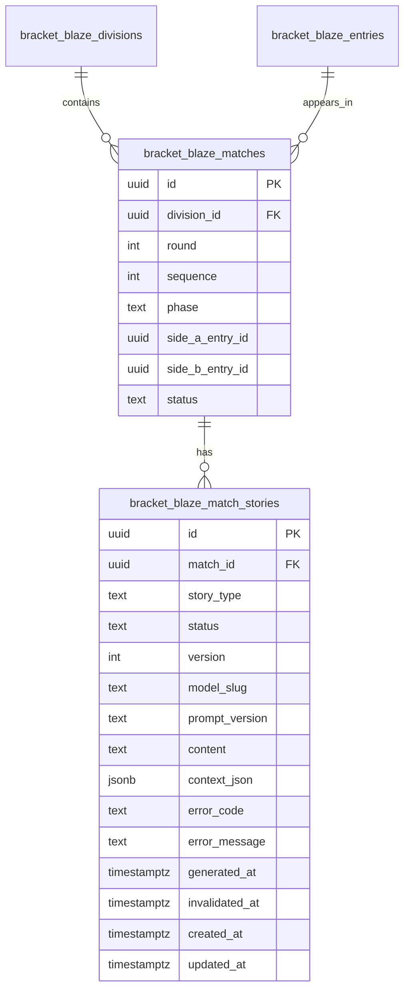

# feat: Live Portal Match Stories

## Overview

Add a spectator-first story layer to the public live portal so each live or completed match can explain why it matters. The live portal stays score-first, but each match card gains an inline expandable story section that shows short pre-match framing while the match is on court and a short post-match recap once the match is completed.

This plan carries forward the dedicated per-match story approach chosen in the brainstorm, including spectator-focused tone, inline expansion in the existing match card, pre-match stories generated ahead of time per match, post-match recaps after completion, knockout placeholder stories for unresolved slots, and extra polish for finals (see brainstorm: `docs/brainstorms/2026-03-07-live-portal-match-stories-brainstorm.md`).

## Problem Statement

The current public live portal exposes scores, rounds, courts, and standings, but it does not help a remote spectator understand the stakes of a match. A viewer who was not at the venue has to infer storylines from raw results alone.

The live page already has the right surface area for this feature:

- Public server-rendered route with live/completed match data: `app/live/[tournamentId]/page.tsx:11-95`
- Mobile-first client feed with realtime reloads and live score broadcasts: `components/live-portal/live-portal-client.tsx:30-210`
- Compact match-card UI that is currently score-only: `components/live-portal/match-card.tsx:32-152`

What is missing is a durable story artifact tied to match lifecycle events. This must not be generated on click, must not block tournament operations, and must not turn the live portal into a noisy wall of copy.

## Proposed Solution

Introduce a dedicated match-story data layer that sits beside `bracket_blaze_matches` rather than inside `matches.meta_json`. Each match will have story records with explicit type and status:

- `pre_match`: created when the match is created or materially changes
- `post_match`: created when the match result is finalized

The live portal will fetch the current story for each visible match and render it inside an expandable section on the existing match card. For `on_court` matches, the card shows the current `pre_match` story. For `completed` or `walkover` matches, it switches to the `post_match` recap when available.

Generation will use OpenRouter with `openai/gpt-oss-120b`, leveraging JSON output controls so the app can request a predictable object shape and store only clean text plus metadata. OpenRouter’s chat endpoint is OpenAI-compatible, supports Bearer auth, and documents JSON/structured output support (OpenRouter docs, model + auth + parameters pages).

To keep admin flows responsive, the MVP should treat story generation as best-effort side work executed from the existing Server Action flow using `after()`:

- Bulk creation events trigger story generation after match creation
- Single-match lifecycle events attempt focused regeneration without blocking the primary mutation
- Fallback copy ensures the live portal never shows a broken state when the LLM request fails or is delayed

## Technical Approach

### Architecture

This feature touches four layers:

1. **Persistence**
   - Add a dedicated `bracket_blaze_match_stories` table plus supporting types/indexes/RLS.
   - Store story content, story type, lifecycle status, prompt version, source snapshot hash, model slug, error state, and timestamps.

2. **Story context builder**
   - Build reusable server-side context assembly helpers that derive:
     - tournament/division/round labels
     - side names
     - Swiss history and head-to-head from completed matches
     - dominant-win and bounce-back arcs from previous rounds
     - knockout slot route context when entrants are unresolved
     - final score summary for post-match recap
   - Reuse standings/tiebreak inputs already present in `lib/services/standings-engine.ts:33-245`, especially the stored head-to-head map in `tiebreak_json.h2h_results`.

3. **Generation pipeline**
   - Add a single OpenRouter-backed generation service that accepts normalized story context and returns validated short-form copy.
   - Use structured JSON mode or `response_format` so the service can parse a predictable `{ text, tone }` style response.
   - Batch pre-match generation for round/draw creation flows to avoid one request per inserted match when many matches are created together.

4. **Live portal rendering**
   - Extend the live route query to fetch story rows for visible matches.
   - Add inline expand/collapse affordance inside `MatchCard`.
   - Subscribe to story-row updates in addition to match updates so story completion appears without requiring a manual refresh cycle.

### Proposed Data Model

Use a dedicated table rather than embedding story text in `matches.meta_json` (see brainstorm: `docs/brainstorms/2026-03-07-live-portal-match-stories-brainstorm.md`).

Suggested MVP shape:

Recommended constraints:

- `story_type` enum or check constraint: `pre_match`, `post_match`
- `status` enum or check constraint: `pending`, `generating`, `ready`, `failed`, `stale`
- Unique current row per `(match_id, story_type)` for MVP
- `version` integer increments on overwrite/regeneration
- Indexes on `(match_id, story_type)`, `status`, and `updated_at`

Rationale:

- Matches the chosen dedicated story layer (see brainstorm)
- Keeps retries/regeneration explicit
- Avoids polluting score state in `meta_json`
- Gives the live portal a single source of truth for story readiness

### Lifecycle Integration Points

The existing codebase already has clear match lifecycle seams:

- Draw creation: `lib/actions/draws.ts:38-199`
- Next Swiss round generation: `lib/actions/draws.ts:253-379`
- Knockout bracket generation: `lib/actions/draws.ts:384-527`
- Match start (`ready` -> `on_court`): `lib/actions/matches.ts:38-83`
- Match completion / approval / walkover: `lib/actions/matches.ts:90-226`, `lib/actions/matches.ts:232-304`, `lib/actions/matches.ts:360-436`
- Knockout entrant advancement after completion: `lib/actions/matches.ts:547-573`

Plan the story lifecycle around those hooks:

#### Pre-match story creation

- `generateDraw()`:
  - create `pre_match` story rows for all inserted Round 1 matches except byes
  - byes should not generate spectator stories
- `generateNextSwissRound()`:
  - create `pre_match` story rows for inserted Swiss matches except byes
- `generateKnockoutDraw()`:
  - create `pre_match` story rows for all inserted knockout matches
  - if a slot is unresolved, the context should describe the possible qualifiers or feeder matches rather than pretending both entrants are known

#### Pre-match story refresh

- `advanceKnockoutWinner()`:
  - mark downstream `pre_match` story as `stale`
  - regenerate when entrant composition changes
- `editMatchScore()`:
  - if winner changes and downstream slot changes, downstream story must be invalidated and regenerated
- Any future manual reseeding/redraw flows should also invalidate affected `pre_match` stories

#### On-court guarantees

- `startMatch()` should not block on the LLM call, but it should ensure the `pre_match` story is at least present or marked `pending`.
- If the story is missing/failed/stale at start time, perform a bounded best-effort regeneration attempt after the response using `after()`, since Next.js 15 documents `after()` as stable for Server Actions and Route Handlers.

#### Post-match recap creation

- `completeMatch()`, `approveMatch()`, and `recordWalkover()` should trigger `post_match` generation for the finalized match via `after()`.
- The recap should replace the pre-match story in the live UI once the match is completed and the recap is ready.
- If recap generation fails, show deterministic fallback recap text derived from score/winner data until regeneration succeeds.

#### Cleanup

- `deleteAllMatches()` should delete match-story rows through FK cascade or explicit cleanup.

### Story Context Rules

The context builder should stay deterministic and avoid letting the model infer facts it was not given.

Required context inputs:

- Tournament name
- Division name
- Phase and round label
- Entry display names
- Knockout round label (`Quarter-Final`, `Semi-Final`, `Final`, etc.)
- Completed match history for both sides within the same division
- Head-to-head result if these entries have already met in Swiss
- Swiss recovery arc:
  - lost earlier, now qualified or advanced
  - unbeaten or dominant point differential so far
- Completed match score summary for post-match recap

Specific rules:

- `Round 1`: generic but specific framing tied to tournament and division context
- `Swiss rematch`: explicitly mention prior meeting when present
- `Knockout unresolved slots`: describe potential routes and likely matchup stakes, not fabricated entrants
- `Walkover`: recap should state the walkover plainly without inventing rallies or momentum swings
- `Bye`: no story generation
- `Final`: allow a richer template or higher tone, but still constrain output to 2-4 short sentences

### OpenRouter Integration

External research indicates:

- OpenRouter uses Bearer-token auth and OpenAI-compatible request shapes
- Raw API calls can target `https://openrouter.ai/api/v1/chat/completions`
- Optional headers `HTTP-Referer` and `X-OpenRouter-Title` are supported
- `response_format` supports JSON mode and documented structured output behavior
- Common recoverable failure classes include `402`, `429`, `502`, and `503`

Planning decisions:

- Add `OPENROUTER_API_KEY` to environment management and `.env.example`
- Use raw `fetch` instead of introducing a new SDK dependency; `package.json` currently has no AI client dependency
- Centralize the provider call in one server-only module, e.g. `lib/services/match-story-generator.ts`
- Use low-variance sampling defaults tuned for short, factual-but-polished text
- Add retry policy for transient failures (`429`, `502`, `503`, empty-content responses)
- Do not block tournament-critical mutations on provider success

### Realtime and Live Portal Changes

The live portal currently:

- fetches visible matches server-side: `app/live/[tournamentId]/page.tsx:37-80`
- listens for broadcast score updates and full-page reloads on match-table updates: `components/live-portal/live-portal-client.tsx:52-110`
- renders compact match cards with no expandable content: `components/live-portal/match-card.tsx:63-151`

Planned changes:

- Extend the server route to fetch the current story rows for visible matches and map them by `match_id`
- Pass story data to `LivePortalClient` and `MatchCard`
- Add inline expand/collapse control in `MatchCard`
- Keep the default collapsed state so the feed remains scannable on mobile (see brainstorm)
- Subscribe to `bracket_blaze_match_stories` `postgres_changes` so the card updates when a story moves from `pending`/`failed` to `ready`
- Show a small generation/loading placeholder for just-finished matches until `post_match` is ready

### Performance Constraints

This feature is at risk of introducing slow bulk admin actions and N+1 context queries if implemented naively. Existing repo learnings explicitly warn against function-in-loop queries and repeated participant/team lookups (`docs/solutions/2026-02-22-n1-query-performance-analysis.md`, `docs/solutions/QUERY-PATTERNS-REFERENCE.md`).

Apply those learnings directly:

- Build per-division lookup maps for entries, participants, teams, completed matches, standings, and head-to-head history
- Batch fetch all historical match inputs needed for a round before generating stories
- Batch pre-match prompts by round where practical instead of one LLM request per match
- Avoid any per-card fetch from the live page
- Keep story content persisted so the public page remains read-only and cheap

## Implementation Phases

### Phase 1: Story Persistence and Context Builder

- Add migration for `bracket_blaze_match_stories`
- Add types to `types/database.ts`
- Add RLS:
  - public read for stories attached to published-division matches
  - tournament-admin insert/update for story rows
- Implement context builder utilities for:
  - entry naming
  - Swiss history aggregation
  - knockout slot resolution
  - recap summaries
- Add deterministic fallback generators for pre-match and post-match text

Success criteria:

- Story rows can be created, updated, marked stale, and fetched with RLS-correct access
- Context builder produces structured, testable input for singles and doubles

### Phase 2: OpenRouter Generation Service and Lifecycle Hooks

- Add server-only OpenRouter client wrapper
- Add prompt templates and JSON schema validation
- Integrate hook points into:
  - `generateDraw()`
  - `generateNextSwissRound()`
  - `generateKnockoutDraw()`
  - `startMatch()`
  - `completeMatch()`
  - `approveMatch()`
  - `recordWalkover()`
  - downstream knockout-entrant updates
- Use `after()` as the single MVP non-blocking execution path for story generation and regeneration
- Add retries and failure-state recording

Success criteria:

- New matches get `pre_match` stories without user clicks
- Completed matches get `post_match` recap rows
- Downstream knockout match stories refresh when entrants change
- Admin operations still succeed even if OpenRouter is down

### Phase 3: Live Portal UI and Realtime

- Extend `app/live/[tournamentId]/page.tsx` to load story data
- Update `LivePortalClient` prop shape and realtime subscriptions
- Update `MatchCard` with:
  - expand/collapse affordance
  - current story selection logic
  - pending/failed/fallback states
  - finals polish treatment hook if story metadata flags it
- Keep mobile-first layout readable when expanded

Success criteria:

- On-court cards can expand to reveal pre-match stories
- Completed cards show post-match recap when ready
- Story updates appear without a manual refresh

## Alternative Approaches Considered

### 1. Store story text directly on `matches.meta_json`

Rejected because it mixes commentary lifecycle with scoring state, makes retries/failures opaque, and weakens future extensibility. The brainstorm explicitly chose a dedicated story layer instead (see brainstorm: `docs/brainstorms/2026-03-07-live-portal-match-stories-brainstorm.md`).

### 2. Generate stories on click

Rejected because the brainstorm explicitly ruled out per-click generation. It would also produce inconsistent spectator experience and slower UI.

### 3. Separate story detail screen instead of inline expansion

Rejected because it breaks the existing scan-and-tap flow of the live portal and adds navigation friction on mobile. The chosen placement is inline expansion in the match card (see brainstorm).

### 4. Manual editorial workflow for finals only

Deferred. Finals can use a richer prompt/tone in MVP without requiring a separate human-edit pipeline.

## System-Wide Impact

### Interaction Graph

- `generateDraw()` / `generateNextSwissRound()` / `generateKnockoutDraw()`
  - insert matches
  - create or mark pending pre-match story rows
  - trigger generation work via `after()`
  - revalidate division paths
- `startMatch()`
  - updates match status to `on_court`
  - ensures pre-match story exists or re-queues it
  - revalidates affected paths
- `completeMatch()` / `approveMatch()` / `recordWalkover()`
  - finalize match result
  - may advance knockout winner to downstream slot
  - create post-match story row
  - mark downstream pre-match story stale if entrants changed
  - revalidate affected paths
- Live portal page load
  - fetches matches + story rows + standings + draws
  - subscribes to both match and story updates

### Error & Failure Propagation

- OpenRouter request failures should update story status to `failed` or leave fallback-ready content; they must not fail the core tournament mutation.
- `402` insufficient credits should surface in admin logs/status, but spectator UI should still show fallback text.
- `429`, `502`, `503`, and empty-content cases should retry with bounded backoff.
- JSON parse/validation failures should be treated as generation failures, not as partial story success.

### State Lifecycle Risks

- Match created but story generation fails:
  - keep `pending`/`failed` row and render deterministic fallback
- Match completes before pre-match story was ever ready:
  - skip to post-match recap generation and ignore stale pre-match state
- Knockout entrant changes after initial story generation:
  - downstream pre-match story must be invalidated and regenerated
- Score edits that change knockout advancement:
  - downstream story and any future route context must be refreshed
- Delete-all-matches:
  - story rows must be cascaded or explicitly removed to avoid orphaned artifacts

### API Surface Parity

Surfaces that need consistent story awareness:

- Public live portal: yes
- Control center results/matches pages: optional follow-up, not required for MVP
- Court TV: no story rendering in MVP
- Ref scoring app: no story rendering in MVP

Shared code paths that need updates:

- match creation flows in `lib/actions/draws.ts`
- match completion flows in `lib/actions/matches.ts`
- live page query in `app/live/[tournamentId]/page.tsx`

### Integration Test Scenarios

1. Generate Round 1 for a Swiss division with doubles entries and confirm all non-bye matches receive ready or pending pre-match story rows, with no per-match fetches from the live page.
2. Complete a Swiss rematch, then verify the completed card switches from pre-match story to post-match recap and the live portal reflects the story-row update.
3. Generate a knockout bracket with unresolved future matches, then complete a semifinal and confirm the final’s pre-match story invalidates and regenerates around the actual finalists.
4. Edit a completed knockout result that changes the winner before the next round starts, and verify downstream story rows refresh accordingly.
5. Simulate OpenRouter `429` or `502` responses and confirm admin operations still succeed, story rows record failure state, and spectator UI falls back cleanly.

## Acceptance Criteria

### Functional Requirements

- [x] Each non-bye match can have a dedicated story record for `pre_match` and `post_match`.
- [x] Pre-match stories are generated ahead of time per match as part of tournament flow, never on user click (see brainstorm).
- [x] On the live portal, story UI is inline-expandable inside each match card, not a separate page or modal (see brainstorm).
- [x] On-court matches display pre-match story content when expanded.
- [x] Completed and walkover matches display post-match recap content when expanded.
- [ ] Round 1 stories still render meaningful generic tournament/division framing even without prior history.
- [ ] Swiss stories can mention head-to-head and prior-match arcs when the data exists.
- [ ] Knockout stories can describe possible entrants or routes when a slot is unresolved (see brainstorm).
- [ ] Finals receive visibly richer tone while remaining within the same short-format story block (see brainstorm).
- [x] Story generation never blocks match creation, match start, or match completion from succeeding.
- [x] Story updates propagate to the live portal without requiring a user click or manual refresh.
- [x] Byes do not generate stories.
- [x] Walkover recaps do not fabricate gameplay details.

### Non-Functional Requirements

- [x] Story generation uses OpenRouter with `openai/gpt-oss-120b` (see brainstorm).
- [ ] Story output is limited to 2-4 short sentences with sparse emoji usage (see brainstorm).
- [ ] Public story reads respect published-division access rules under RLS.
- [x] Story generation failures degrade gracefully to deterministic fallback text.
- [x] Batch context building avoids known N+1 anti-patterns from prior repo learnings.
- [x] Live portal remains mobile-friendly when cards expand.

### Quality Gates

- [ ] Unit tests cover context-builder branches: round 1, rematch, dominant run, bounce-back, unresolved knockout slot, final, walkover, bye skip.
- [ ] Integration tests cover lifecycle hooks across draw generation, match start, completion, approval, walkover, and knockout advancement.
- [ ] Manual verification on the live portal confirms realtime story updates and acceptable expanded-card readability on mobile and desktop.
- [ ] Environment and operational docs include OpenRouter setup and failure expectations.

## Success Metrics

- Spectator can understand match stakes from a single expanded card without needing standings context.
- 95%+ of visible live/completed matches show either generated story content or fallback text, never a blank story area.
- Story generation failures do not block any tournament-critical admin action.
- Added story queries do not materially slow live portal render or create per-card fetch waterfalls.

## Dependencies & Prerequisites

- OpenRouter API key provisioned securely in environment variables
- OpenRouter credits/rate limits sufficient for tournament-scale usage
- Supabase migration for new story table and policies
- Final prompt schema and prompt versioning strategy
- MVP generation path uses existing Server Actions plus `after()`; a queue worker is explicitly out of scope for this implementation

## Risk Analysis & Mitigation

### Risk: Bulk round generation becomes slow

Mitigation:

- Batch story generation by round
- Keep mutation success independent from generation success
- Use `after()` to shift story generation off the critical response path

### Risk: Query explosions when building story context

Mitigation:

- Follow documented batch/eager-loading patterns from `docs/solutions/2026-02-22-n1-query-performance-analysis.md`
- Preload historical matches and entry/team lookups per division

### Risk: Provider outage or credit exhaustion

Mitigation:

- Record failure state
- Retry transient failures
- Render deterministic fallback copy
- Keep admin flows non-blocking

### Risk: Story inaccuracies or hallucinated details

Mitigation:

- Supply only structured factual context to the generator
- Constrain output shape/length
- Avoid asking the model to infer missing match details
- Special-case walkovers and unresolved knockout slots

### Risk: Realtime mismatch between match status and story status

Mitigation:

- Subscribe to story-table updates as well as match-table updates
- Use explicit status fields (`pending`, `ready`, `failed`, `stale`)

## Resource Requirements

- Medium implementation effort across database, server actions, and live UI
- External dependency budget for OpenRouter usage
- Manual QA on desktop and mobile live portal views

## Future Considerations

- Manual admin override/edit for marquee stories
- Multiple story styles per audience (spectator vs player utility)
- Story surfaces in Court TV or result emails
- Analytics on story expansion rate and dwell time
- Offline or cached alternative model/fallback provider

## Documentation Plan

- Update `.env.example` with `OPENROUTER_API_KEY`
- Add internal documentation for story lifecycle and failure behavior
- Update live-portal feature docs if story rendering materially changes the user-facing experience
- Add a short operational note on provider outages, credits, and retries

## Sources & References

### Origin

- **Brainstorm document:** `docs/brainstorms/2026-03-07-live-portal-match-stories-brainstorm.md`
  - Carried-forward decisions:
    - Dedicated story layer per match
    - Spectator-first tone and inline expandable card UI
    - Pre-match on `on_court`, post-match recap after completion
    - OpenRouter + `openai/gpt-oss-120b`

### Internal References

- Live portal route: `app/live/[tournamentId]/page.tsx:11-95`
- Live portal client realtime behavior: `components/live-portal/live-portal-client.tsx:30-210`
- Match card UI: `components/live-portal/match-card.tsx:32-152`
- Draw generation lifecycle: `lib/actions/draws.ts:38-527`
- Match lifecycle and knockout advancement: `lib/actions/matches.ts:11-573`
- Standings + H2H source data: `lib/services/standings-engine.ts:33-245`
- Public match/draw/standings RLS patterns: `supabase/migrations/20250101000003_rls_policies_prefixed.sql:168-346`
- Query/performance learnings:
  - `docs/solutions/2026-02-22-n1-query-performance-analysis.md`
  - `docs/solutions/QUERY-PATTERNS-REFERENCE.md`
  - `docs/solutions/RESEARCH-SUMMARY.md`

### External References

- OpenRouter authentication: [Authentication docs](https://openrouter.ai/docs/api-reference/authentication)
- OpenRouter request parameters and JSON mode: [Parameters docs](https://openrouter.ai/docs/api-reference/parameters)
- OpenRouter model page for `openai/gpt-oss-120b`: [Model page](https://openrouter.ai/openai/gpt-oss-120b/api)
- OpenRouter error handling: [Errors and debugging docs](https://openrouter.ai/docs/api-reference/errors-and-debugging)
- OpenRouter limits: [Limits docs](https://openrouter.ai/docs/api-reference/limits/)
- Next.js `after()` API: [after docs](https://nextjs.org/docs/app/api-reference/functions/after)
- Next.js 15.1 stabilization note for `after()`: [Next.js 15.1 blog](https://nextjs.org/blog/next-15-1)

### Related Work

- Public live portal brainstorm: `docs/brainstorms/2026-02-22-public-live-portal-brainstorm.md`
- Public live portal implementation plan: `docs/plans/2026-02-22-feat-public-live-portal-plan.md`
